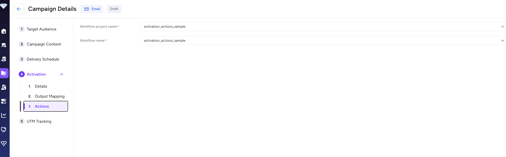
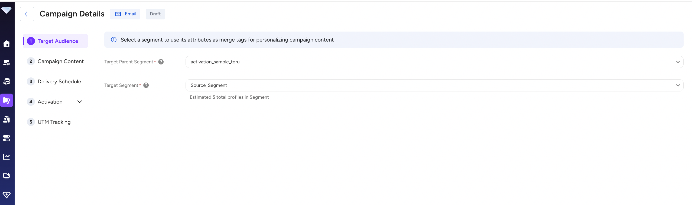
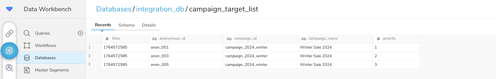
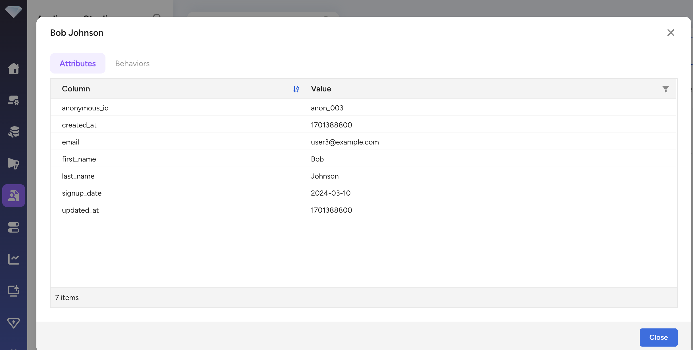

# Activation Actions: Filter Parent Segment by Target List

This sample demonstrates how to filter a Parent Segment by joining with a target list table using anonymous_id in Treasure Data's Activation Actions.

Official samples: https://github.com/treasure-data/treasure-boxes/tree/master/activation_actions

## Purpose

1. **Use Activation Actions**: Receive table name specified in String Builder as a custom parameter
2. **Parent Segment Structure**: Contains email and anonymous_id fields
3. **Dynamic Table JOIN**: Join specified target table with Parent Segment using anonymous_id, filtering only records that exist in the target list
4. **Final Output**: Output filtered results in a format that can be used for email delivery in Engage Studio

## File Structure

```
.
├── filter_by_target_list.dig       # Main workflow definition
├── queries/
│   ├── filter_segment.sql          # Filtering query
│   ├── setup_sample_data.sql       # Sample data reference
│   ├── setup_parent_segment.sql    # Create Parent Segment table
│   └── setup_target_list.sql       # Create Target List table
├── images/
│   ├── activation_actions_config.png  # Output Mapping configuration
│   ├── parent_segment_data.png        # Target list data
│   ├── query_result.png               # Filtered result
│   ├── workflow_execution.png         # Target Audience setup
│   └── workflow_result.png            # Workflow configuration
├── README.md                        # This file (English documentation)
└── README_ja.md                     # Japanese documentation
```

## Data Structure

### Parent Segment Table
```sql
parent_segment (
  anonymous_id VARCHAR,   -- Anonymous ID (JOIN KEY)
  email VARCHAR,          -- Email address
  created_at BIGINT,      -- Created timestamp
  updated_at BIGINT       -- Updated timestamp
)
```

### Target List Table (Example: campaign_target_list)
```sql
campaign_target_list (
  anonymous_id VARCHAR,   -- Anonymous ID (JOIN KEY)
  campaign_id VARCHAR     -- Campaign ID
)
```

### Output
```sql
-- All columns from Parent Segment
-- (Only records that exist in the target table)
anonymous_id VARCHAR,
email VARCHAR,
created_at BIGINT,
updated_at BIGINT,
...
```

## Built-in Parameters for Activation Actions

Activation Actions automatically passes the following parameters:

- `activation_actions_db`: Database name where Parent Segment is stored
- `activation_actions_table`: Parent Segment table name (fully qualified: `database.table`)

Details: https://docs.treasuredata.com/articles/#!pd/activation-actions-parameters

## Workflow Operation

### 1. Parameter Reception

This workflow uses the following parameters:

- `activation_actions_db`: Database name automatically passed from Activation Actions
- `activation_actions_table`: Parent Segment table name (fully qualified: `database.table`) automatically passed from Activation Actions
- `integration_db`: Database name where target table is stored (custom parameter, default: `integration_db`)
- `target_table_name`: Target table name specified in String Builder (custom parameter)

### 2. Filtering Process

`queries/filter_segment.sql` is executed and:

1. Reads `${activation_actions_table}` (Parent Segment - already includes database name)
2. Performs INNER JOIN with specified target table (`${integration_db}.${target_table_name}`) using anonymous_id
3. Extracts only records where email and anonymous_id are not NULL
4. Returns all columns from Parent Segment (excluding target table columns)
5. Returns result as Activation output (or sends to destination specified by `result_connection`)

### 3. Output

- Default: Query result is returned as Activation output
- Optional: Can directly export to Engage Studio, etc. by specifying `result_connection` and `result_settings`

## Usage

### Activation Actions Setup

1. **Create Parent Segment in Segment Builder**
   - Must include anonymous_id and email fields

2. **Configure Activation Actions**:
   - Action Type: Treasure Workflow
   - Workflow project name: `filter_by_target_list`
   - Workflow name: `filter_by_target_list`
   - Custom Parameters (String Builder):
     ```
     integration_db=integration_db
     target_table_name=campaign_target_list
     ```

   

### Upload Workflow

```bash
# Upload workflow to Treasure Data
td wf push filter_by_target_list
```

### Local Test Execution

```bash
# Test by simulating Activation Actions environment
td wf run filter_by_target_list.dig \
  -p activation_actions_db=sample_db \
  -p activation_actions_table=sample_db.parent_segment \
  -p integration_db=integration_db \
  -p target_table_name=campaign_target_list
```

## Data Flow Diagram

```
┌─────────────────────────┐
│   Parent Segment        │
│  (email, anonymous_id)  │
└───────────┬─────────────┘
            │
            │ INNER JOIN (anonymous_id)
            │
┌───────────▼─────────────┐
│   Target Table          │
│  (anonymous_id, ...)    │
└───────────┬─────────────┘
            │
            │ Filter
            │
┌───────────▼─────────────┐
│ Filtered Result         │
│ (All Parent Segment     │
│  columns)               │
└─────────────────────────┘
            │
            ▼
   Engage Studio (Email)
```

## Sample Data Operation Example

### 1. Target Audience Setup

Select a Parent Segment that contains email and anonymous_id fields.



### 2. Output Mapping Configuration

Configure the output columns and String Builder parameters:
- **Attribute Columns**: Map email field from the segment
- **String Builder**: Set `target_table_name` parameter (e.g., `campaign_target_list`)


### 3. Target List Data

The target table (`integration_db.campaign_target_list`) contains only 3 records:



### 4. Filtered Result

After the workflow executes, only 3 records matching the target list are returned:



**Summary:**
- Parent Segment: 5 records (anon_001 through anon_005)
- Target List: 3 records (anon_001, anon_003, anon_005)
- Filtered Result: 3 records with all Parent Segment columns

## Next Steps

This sample implements the core filtering logic using Activation Actions.
For actual operations, consider implementing the following additions:

1. **Export to Engage Studio**

   Uncomment the `result_connection` and `result_settings` parameters in `filter_by_target_list.dig`:
   ```yaml
   +filter_by_target_list:
     td>: queries/filter_segment.sql
     result_connection: ${result_connection_name}
     result_settings: ${result_connection_settings}
   ```

2. **Error Handling**
   - Handle cases where target table does not exist
   - Notification when JOIN result is 0 records

3. **Logging**
   - Record count before and after filtering
   - Execution log tracking

## Notes

- `target_table_name` is a required parameter
- `integration_db` parameter specifies the database where the target table is stored (can be different from Parent Segment database)
- `activation_actions_table` is a fully qualified table name (includes database name), so use it directly without prepending database name
- anonymous_id must have non-NULL values in both tables
- Using INNER JOIN, so records that don't exist in Target Table are excluded
- Result includes all columns from Parent Segment only (target table columns are not included)
