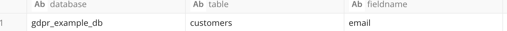

**OVERVIEW OF GDPR WORKFLOW**

General Data protection Regulation is a regulation in EU on data
protection and personal privacy of all the citizens of EU. Arm Treasure
data has built up custom workflows to meet Data compliance for GDPR.

Arm Treasure Data GDPR custom workflow (gdpr\_workflow)
support three general requests for GDPR update, delete and inform.
Custom workflow uses following 3 tables to serve the GDPR requests.User
need to create following tables and populate these table with their
master and foreign tables on which customer has requested GDPR.

1\. **pii\_map\_master**: pii\_map\_master is used to contain information
about the master tables. It has following schema.

• **Database**: Database in which master table lives.

• **Table**: Master Table name

• **FieldName**: FieldName is the field of a master table on which a
 customer has requested GDPR

 **Example:**

2.**pii\_map\_foreign**: pii\_map\_foreign is used to contain
information about all the foreign tables related to a master table with
a respective foreign key. It has following schema.

• **Master**\_db: Database in which master table resides.

• **Master**\_**table**: Master Table name

**• Master\_fn\_name:** It's the field of a master table on which
customer has requested GDPR.

**• Foreign\_key**: Field which uniquely identifies the Foreign Tables

**• Foreign\_db:** Database in which Foreign Table resides.

**• Foreign\_table**: Foreign Table Name

 **Example:**

3.**Params:** Params table is the most important table. It gathers all
the parameter value related to the GDPR request. For Example: type of
request, new value to be updated etc .It has following Schema which
might need to be further built up by user as per the use case.

-   **Operation**: Its value can be 'DELETE','UPDATE 'or 'INFORM' as per
    GDPR request.

-   **(Email, Name):** Field Name should be on which GDPR has been
    requested. For example: email, Id etc. Generally It should match
    master\_fn\_name from pii\_map\_foreign or FieldName from
    pii\_map\_master .This column name vary on different use cases.

-   **New\_Value**: If GDPR request is "Update", then the new\_value
    field should have the value which need to be updated.

   **Example:**

    

**WorkFlow Operations:**

  - Once all above tables populate with the respective use case.
    User can proceed with running a workflow.

 -  Workflow sequentially run Delete, Inform and Update
  operations. If user need to perform a single operation out of delete,
  update or inform & the number of tables and records need to be
  processed are large, its suggested that user create a new workflow and
  copy only the respective operation from the existing customize
  workflow.

 - **WorkFlow used two parameters**:

                 a) **Database:** Name of a database in which params
table is present

                 b) **params\_table:** Name of param table (params in
our case)

       _export:
          td:
           database: gdpr_example_db
           param_table: params
         
         

- **Delete Operation**: For Delete operation user need to make an
  entry in params table with operation value defined as 'DELETE' and
  populate the value of Field name (email,name, id etc) in a params
  table. Delete operation performed by wf is simple, it\'s just loop
  over all the master tables and foreign tables present in
  pii\_map\_master & pii\_map\_foreign\_tables and whenever any field
  value(ex:email) matches with params table where operation is equal to
  'DELETE', a record will be deleted from master table and foreign table
  present in pii tables.

- **Udate Operation**: For Update operation, we need to make an
    entry in params table with operation value defined as 'UPDATE' and
    populate the value of FieldName (Name,email,id etc) with the
    existing old value. column "new\_value" column of params table to be
    populate with the new value. (In case new\_value is not populated in
    the params table, we will populate everything in master and foreign
    table with null)

    >Update operation loops over all the master and foreign tables
    present in pii tables. To update a table, wf used insert/delete
    methodology.

    >First Wf insert records with new\_value and then delete the old
    records whenever field value matches with params where operations
    equal to 'UPDATE'

-  **INFORM OPERATION**: For Inform operation, we need to
     make an entry of the field value (for ex: email, ID etc.) & operation
     value defined as "INFORM" in params table.

     >WF create table with a name "INFORM" in a same database where param
     table is present.

   
     >Inform Table will contain master key, foreign keys, tables and
     database and all other associated information with customer as a
     JSON column.

    >Inform table will also contain a column describing the description
    of table. Therefore, we must make sure we have an entry of a table
    with its description in a table called "ppii\_table\_desc\_lookup"

    >Below is an example of a schema and value of a
    "pii\_table\_desc\_lookup".

    

