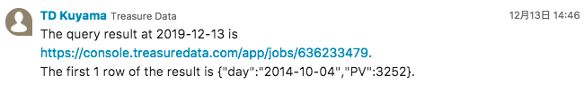

# Workflow: http for Chatwork Example

This example workflow notifies calculated data from TreasureData to Chatwork, using [http](http://docs.digdag.io/operators/http.html) operator.

# Preparation

This example workflow uses [Chatwork API](http://developer.chatwork.com/ja/endpoints.html). 
Ex. https://api.chatwork.com/v2/rooms/...

*Please get your API token from Chatwork console before you use this. The document is [here](https://help.chatwork.com/hc/ja/articles/115000172402-API%E3%83%88%E3%83%BC%E3%82%AF%E3%83%B3%E3%82%92%E7%99%BA%E8%A1%8C%E3%81%99%E3%82%8B).

# How to Run

First, you need to upload the workflow.

    # Upload
    $ td wf push td_chatwork_example

And please set your Chatwork's API token as a secret variable.

    # Set a secret variable
    $ td wf secrets --project td_chatwork_example --set chatwork.token

Now, you can trigger the session manually.
    
    # Run
    $ td wf start td_chatwork_example chatwork_mention --session now

# Results

This example workflow would send the following message.

    
# Next Step

If you have any questions, please contact support@treasure-data.com.
