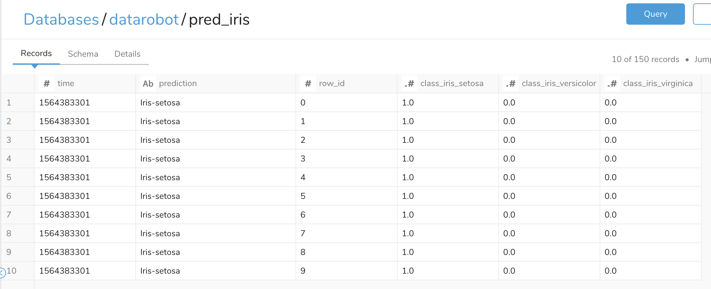

# DataRobot2TreasureData
This digdag workflow creates a table on Treasure Data generated from DataRobot's prediction result using DataRobot Python client.   
  
At first, DataRobot gets feature data from Treasure Data and create `pandas.DataFrame` including prediction result.
Second, `pytd` creates a table on Treasure Data with the dataframe.

## Prerequisite
- Supposes that you already have built a ML model and set Treasure Data as a data source on DataRobot.
- Following parameters are necessary.  

| Variable | Description | Example |
| -------- | ----------- | --------|
| td.apikey | Master API Key for Treasure Data. [link](https://support.treasuredata.com/hc/en-us/articles/360000763288-Get-API-Keys) | `1234/abcdefghijklmnopqrstuvwxyz1234567890`|
| td.database | Treasure Data's database name to export data. | `example_db` |
| td.table | Treasure Data's table name to export data. | `example_table` |
| td.sql | SQL to pass to Treasure Data's to retrieve a prediction data. | `select * from pred_data` |
| dr.apikey | DataRobot's API Key. \*  | `ABcdEFGhIJk12MNoPqrS3uvW_xyz123`|
| dr.username | Email address to log in Datarobot console | `example@yourcompany.com` |
| dr.cloudkey | datarobot-key for DataRobot Cloud Prediction Server. \* | `e1234bc6-1aaa-98de-7f65-1234b5678ccc` | 
| dr.prediction_host | Hostname/IP of DataRobot Prediction Server. \* | `prediction.datarobot.com` | 
| dr.target | Target name of prediction. \* | `is_bad_loan` | 
| dr.deployment_id | Deployment ID for DataRobot. \* | `5d3e76e931c473290afae6fd` | 

\* You can get these parameters from Deployments tab. 
https://app.datarobot.com/deployments/{deployment_id}/integrations

## Push the code and set variables
```
td wf push --project datarobot_integration
td wf secret --project datarobot_integration --set td.apikey
td wf secret --project datarobot_integration --set dr.apikey
td wf secret --project datarobot_integration --set dr.username
td wf secret --project datarobot_integration --set dr.prediction_host
td wf secret --project datarobot_integration --set dr.cloudkey
```

## Result
Prediction result are written into specified table like this.  
  
The table contains prediction result and features.

## Limitation
DataRobot's Prediction API restricts the data size <= 50MB.  
When predicting bigger data, you need to partition and predict for each parts.

## Further Reading
- DataRobot API (You need to login DataRobot)  
https://app.datarobot.com/docs/index.html
- DataRobot Python Client  
https://datarobot-public-api-client.readthedocs-hosted.com/en/v2.17.0/setup/getting_started.html
- pytd  
https://github.com/treasure-data/pytd
