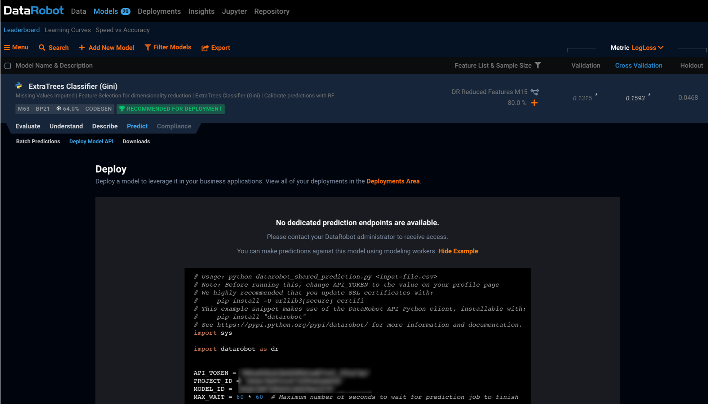

# DataRobot2TreasureData
This digdag workflow creates a table on Treasure Data generated from DataRobot's prediction result using DataRobot Python client.   
  
At first, DataRobot gets feature data from Treasure Data and create `pandas.DataFrame` including prediction result.
Second, `pytd` creates a table on Treasure Data with the dataframe.

## Prerequisite
- Supposes that you already have built a ML model and set Treasure Data as a data source on DataRobot.
- Following parameters are necessary.  

| Variable | Description | Example |
| -------- | ----------- | --------|
| td.apikey | Master API Key for Treasure Data. [link] | `1234/abcdefghijklmnopqrstuvwxyz1234567890`|
| td.username | Email address to log in Treaure Data's console | `example@treasure-data.com` |
| td.password | Password to log in Treasure Data's console | `xxxxxx` |
| td.database | Treasure Data's database name to export data. | `example_db` |
| td.table | Treasure Data's table name to export data. | `example_table` |
| dr.apikey | DataRobot's API Key. \*  | `ABcdEFGhIJk12MNoPqrS3uvW_xyz123`|
| dr.project_id | Project ID for DataRobot. \* | `5d3e76e931c473290afae6fd` | 
| dr.model_id | Model ID for DataRobot. \* | `5d3e7b875844414bffba1579` | 
| dr.datasource_id | Data source ID for DataRobot \** | `5d3e76d06cd83a00139c6a72` |

\* You can get these parameters from the DataRobot's screen below.  
> Select Model > Predict > Deploy Model API


\** You can get `DataSource ID` using Python script. Sets of data source's name and its id appear, so please choose appropriate id.
```python:get_datasource.py
!pip install datarobot
import datarobot as dr
API_TOKEN = 'YOUR API TOKEN'
dr.Client(endpoint='https://app.datarobot.com/api/v2', token=API_TOKEN)
print([tuple([ds.canonical_name, ds.id])  for ds in dr.DataSource.list()])
```

## Push the code and set variables
```
td wf push --project datarobot_integration
td wf secret --project datarobot_integration --set dr.apikey
td wf secret --project datarobot_integration --set td.apikey
td wf secret --project datarobot_integration --set td.username
td wf secret --project datarobot_integration --set td.password
```

## Result
Prediction result are written into specified table like this.  
  
As for classification, the table has the label with the highest probability and probabilities for each label aside from `row_id`

## Further Reading
- DataRobot Python Client  
https://datarobot-public-api-client.readthedocs-hosted.com/en/v2.17.0/setup/getting_started.html
- pytd  
https://github.com/treasure-data/pytd
