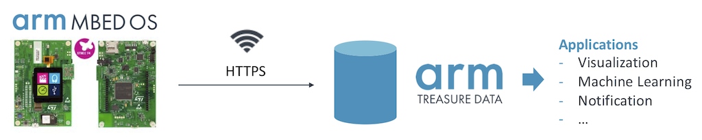

# Sending Data from Mbed OS to Treasure Data

**[Arm Mbed OS](https://www.mbed.com/en/platform/mbed-os/)** is an open-source embedded operating system designed especially for building IoT systems.

Sending data from Mbed OS-enabled devices to Treasure Data allows you to conduct advanced analytics, gain a deeper insight into the physical world, create a variety of data-driven applications, and make business outcomes by integrating with different data sources such as customer attributes and their behavioral data.

## Overview

This Box shows an example of ingesting device heap information to Treasure Data via HTTPS REST API endpoint over WiFi:



Depending on the functionalities of your device (i.e., sensors attached to your device) and code running on Mbed OS, we can collect various physical signals such as environmental conditions. 

## Usage

### Configuration

First and foremost, create `mbed_app.json` based on [`mbed_app.sample.json`](./mbed_app.sample.json), and set `td_apikey`, `td_database`, and `td_table` config values properly.

This Box assumes [DISCO-F413ZH](https://os.mbed.com/platforms/ST-Discovery-F413H/) as an Mbed-enabled device, and we connect the board to the internet via its ISM43362 WiFi module; `SSID` and `PASSWORD` should be updated based on your WiFi environment. If you are using a different board or network drivers (e.g., Ethernet, Cellular), change the config setting in `mbed_app.json`. 

### Installation

This Box uses [`mbed-cli`](https://github.com/ARMmbed/mbed-cli) for compilation:

```sh
pip install -r requirements.txt
```

Make sure your system has [`hg`](https://www.mercurial-scm.org/doc/hg.1.html), a CLI to the Mercurial code management system.

Next, download [GNU Embedded Toolchain for Arm](https://developer.arm.com/tools-and-software/open-source-software/developer-tools/gnu-toolchain/gnu-rm/downloads) and configure a path as follows:

```sh
mbed config -G GCC_ARM_PATH "/path/to/GNU Tools ARM Embedded/bin"
```

### Connecting a device

Connect the board to your machine, and check if it can be detected by the Mbed CLI:

```sh
mbed detect
```

For instance, the command returns:

```
[mbed] Detected "DISCO_F413ZH" connected to "/Volumes/DIS_F413ZH" and using com port "/dev/tty.usbmodem145103"
```

### Compilation

Install dependent Mbed libraries:

```sh
mbed deploy
```

Compile the Box code, and enter to a serial terminal:

```sh
mbed compile --target auto --toolchain GCC_ARM --flash --sterm
```

The terminal tells you that device heap information is being collected and sent to [Treasure Data Postback API](https://support.treasuredata.com/hc/en-us/articles/360000675487-Postback-API):

```
Treasure Boxes (Integration): Mbed OS + Treasure Data
Connected to the network successfully.

MAC: XX:XX:XX:XX:XX:XX
IP: 192.168.1.234
Netmask: 255.255.252.0
Gateway: 192.168.0.1

Sending a POST request to: https://in.treasuredata.com/postback/v3/event/DATABASE_NAME/TABLE_NAME

Data: {"current_size":14188,"max_size":14188,"total_size":14188,"reserved_size":300672,"alloc_cnt":8,"alloc_fail_cnt":0}
Response code: 200
Data: {"current_size":14248,"max_size":74568,"total_size":739799,"reserved_size":300672,"alloc_cnt":10,"alloc_fail_cnt":0}
Response code: 200
...
```

Eventually, the data becomes available in your Treasure Data table.

## References

This Box is a modified version of the following repository:

- [BlackstoneEngineering/mbed-os-example-treasuredata-rest](https://github.com/BlackstoneEngineering/mbed-os-example-treasuredata-rest)

Official documentation using Mbed Online Compiler is available at:

- [Data Ingestion from Mbed OS (HTTP over Wi-Fi)](https://support.treasuredata.com/hc/en-us/articles/360012567313-Data-Ingestion-from-Mbed-OS-HTTP-over-Wi-Fi-)

Besides Postback API, there are alternative ways to ingest data from Mbed OS to Treasure Data; for example:

- [Fluentd](https://github.com/BlackstoneEngineering/mbed-os-example-fluentlogger)
- [Fluent Bit](https://support.treasuredata.com/hc/en-us/articles/360000691168-Data-Ingestion-from-Embedded-Apps-C-C-)
- [MQTT Broker](../mqtt)