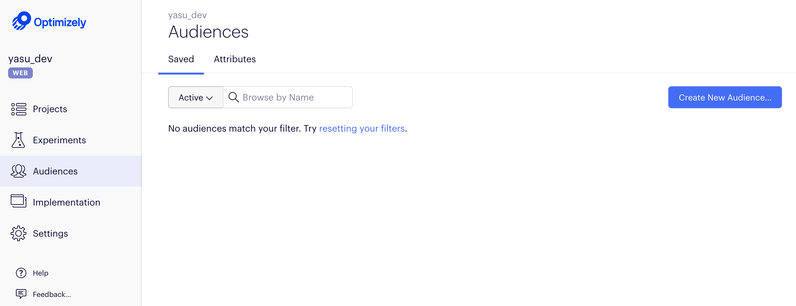
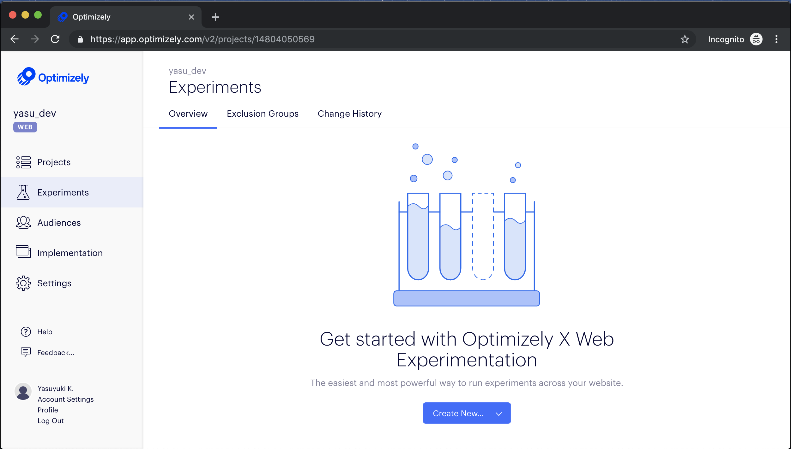
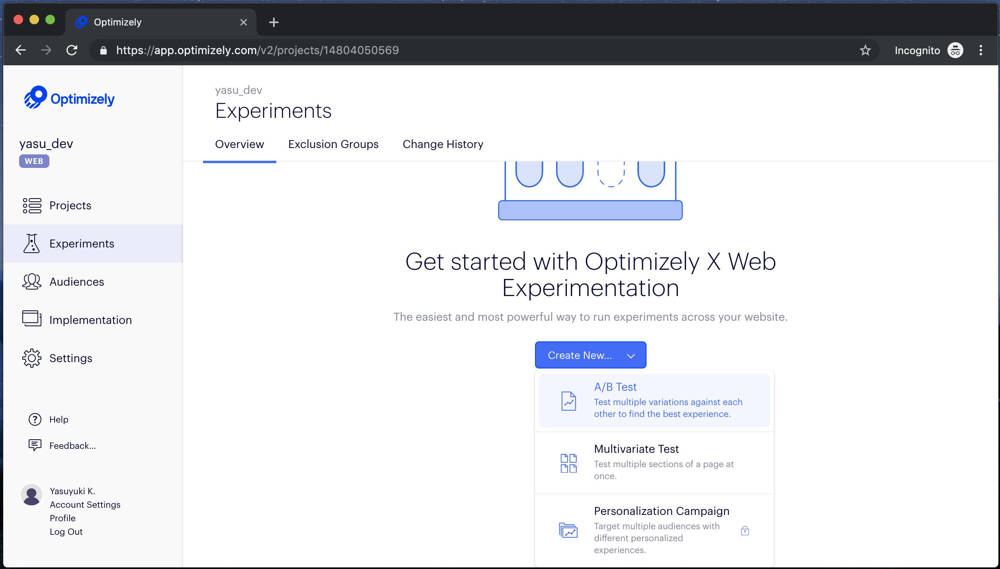
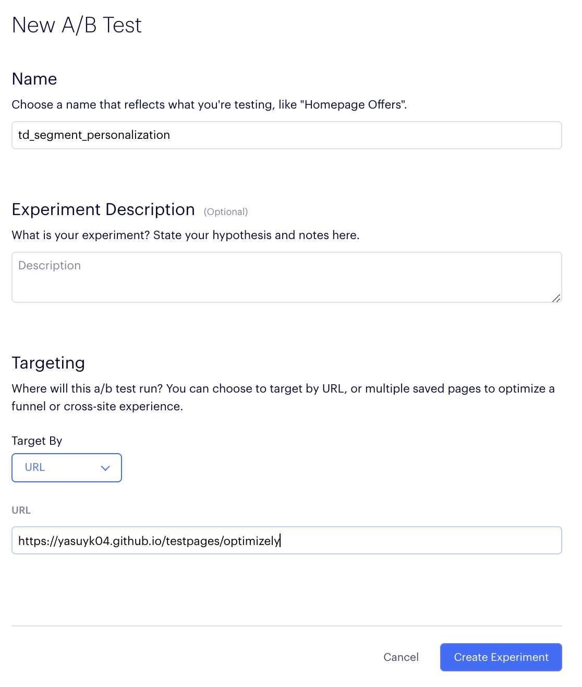
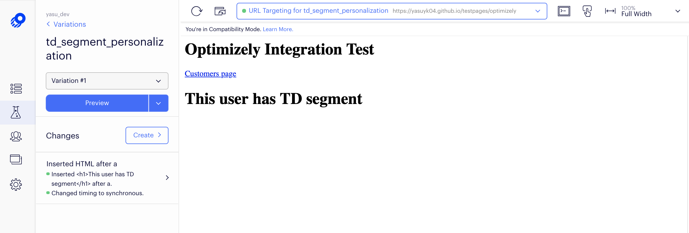
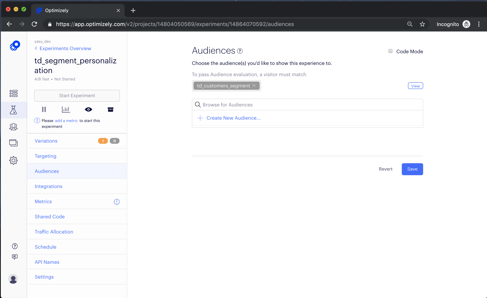
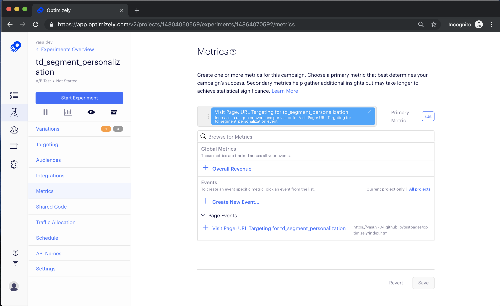
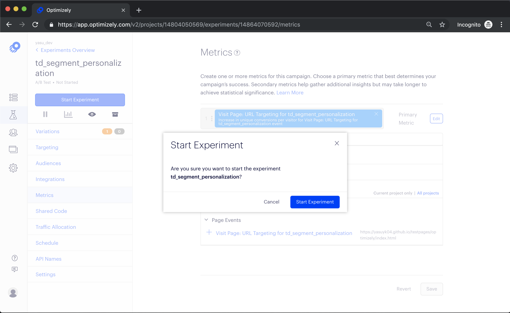
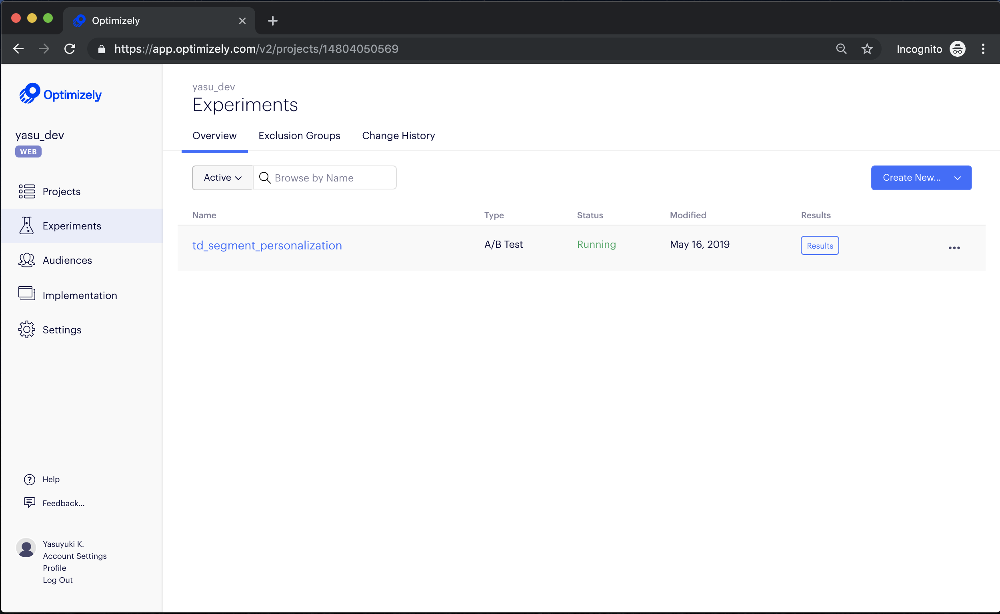
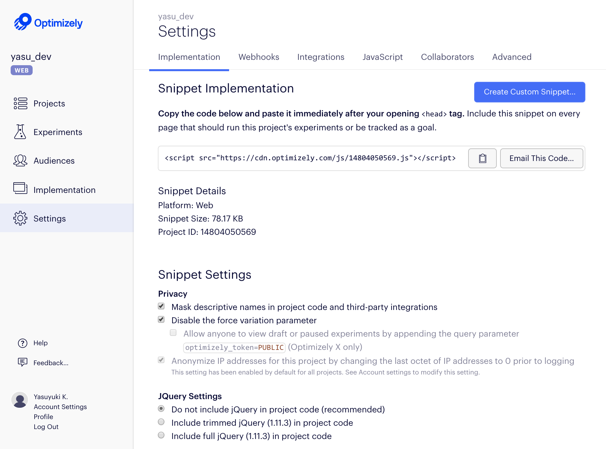

# Integrating TD Profiles API with Optimizely

You can integrate Treasure Data's Profiles API with Optimizely Web Experimentation SDK to create a personalized experience for your customers. Optimizely Web Experimentation is an experimentation platform that allows you to test real visitor experiences on your site using a variety of options including A/B testing, multivariate testing, and personalized campaigns. Optimizely empowers you to make better decisions by improving customer experiences through experimentation.

This integration is a custom integration by the Treasure Data Solution Architect team. If you have any questions, please reach out to your customer success manager.

## Prerequisites 

- Basic knowledge of JavaScript and HTML
- Basic knowledge of Treasure Data
- Basic knowledge of Treasure Data JavaScript SDK
- Basic knowledge of Treasure Data Profiles API
- Basic knowledge of Optimizely Web Experimentation

Use of Treasure Data JavaScript SDK might require the direction of the Treasure Data Support or Services team.

## Operations in Optimizely Web Console

When a user visits a website, which has TD js-SDK, the SDK gets the segment info via TD profiles API. Then By transferring the segments which the user has to Optimizely SDK, the SDK personalizes the contents based on the segment.

This article includes:

- Create a new audience
- Create a new experiment
    - As for starting the Experiment, we also can set scheduled enablement for it.
- Configure the experiment    
- Create a customized SDK code

## Creating a New Audience

By using custom Javascript conditions, you can create an audience configuration for the specific users. 

1. From the Optimizely Web console, navigate to **Audiences**
2. Select **Create New Audience**

3. Type in the name of your new segment.

4. Choose Custom Javascript from the Conditions drag and drop and write the javascript for associated segment.

5. Select **Save** Audience.

## Create Experiment

1. From the Optimizely Web console, navigate to **Experiments**
2. Select **Create New**.

3. Choose the type of experiment you want to set up.

4. Type in the name of your test and optionally, enter the description of the experiment.

5. Select the targeting option from the Target By pulldown. In this case, URL is selected.
6. Enter the designated URL. 
7. Select **Create Experiment**.

## Configure the experiment 

1. From the Optimizely Web Console navigate to new created experiment from **Experiments** tab.
2. From left ribbon menu select **Variations**.
3. Click **Add Variations**.
4. Design different variations and click **Create** to save. 

5. From left ribbon menu select **Targeting**.
6. Select Target By URL and configure other Page Settings as needed. Click **Save**.
7. From left ribbon menu select **Audiences**.
8. Select Audience created in earlier step. Click **Save**. 

9. From left ribbon menu select **Metrics**.
10. Add atleast one metric configuration. Click **Save**.

11. From left ribbon menu click **Start Experiment**.

## Create custom SDK code

From the settings tab, you can get the code to implement to your site.

## Implementation in the Web site

With Optimizely SDK, you need to implement TreasureData SDK code for getting the segment info.

Note-

In Optimizely's Developer document site, says that the SDK code is put in an HTML header area as an HTML script tag format. It also says a user need to set the parameter upper side where the SDK code is placed if you use custom Javascript as a condition. But we need to use Profile API for getting the condition as well as we dynamically load our SDK. Thus in the example, Optimizely SDK is loaded after getting TD segment from the API.

- https://help.optimizely.com/Get_Started/Get_started_with_Optimizely_X_Web_Personalization#1._Implement_the_snippet

- https://help.optimizely.com/Target_Your_Visitors/Custom_JavaScript_audience_targeting

## Sample Codes -

### Sample code using js-SDK

Please refer to **sample.js**

### Sample code by using API directly

Within the basic sample code, we use TD js-SDK for getting TD segment. If you want to improve the performance by skipping the loading our js-SDK, using API directly could be one of the options. 

Please refer to **sample_api_direct.js**

## Reference

- [Optimizely - Getting Started Guide](https://help.optimizely.com/Get_Started/Get_started_with_Optimizely_X_Web_Experimentation_)
- [Optimizely - Building Campaigns](https://help.optimizely.com/Build_Campaigns_and_Experiments/Experiment_Types%3A_AB%2C_Multivariate%2C_and_Multi-page)
- [Treasure Data - Using API Tokens](https://docs.treasuredata.com/display/public/PD/Working+with+Profiles+and+the+Profiles+API+Tokens)
