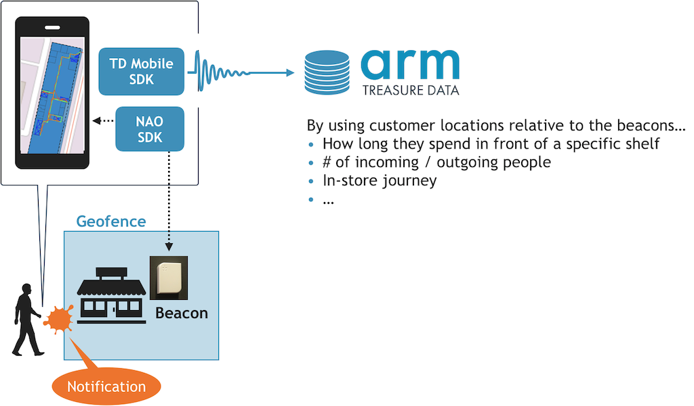
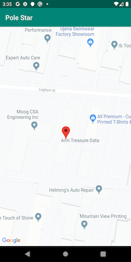
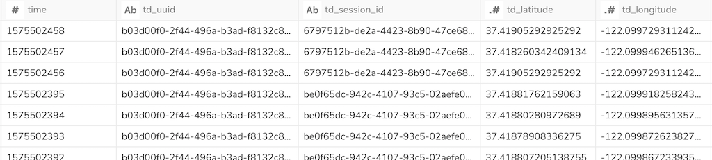
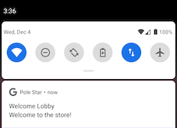

# Indoor Location-Based Mobile App with Pole Star Beacon & SDK

**[Pole Star NAO BlueSpot Beacon](https://www.polestar.eu/products/nao-bluespot/)** and its **[SDK](https://www.polestar.eu/products/nao-sdk/)** allows us to easily and efficiently build indoor location-based service by accurately tracking user's locations, upon a certain consensus of capturing privacy-sensitive real-world behavioral data.



## Overview

This Box showcases a simple Android application that captures (emulated) indoor locations and sends the data points to Treasure Data through [`td-android-sdk`](https://github.com/treasure-data/td-android-sdk).

The app simply puts a marker to its latest location on a map:



The real-world behaviors are stored into a Treasure Data table in the form of latitude-longitude pairs:



Meanwhile, based on the definition of [geofencing](https://www.polestar.eu/services/geofencing/), you will be notified by the app in the background when you enter an area of pre-defined geofences:



We can flexibly define what the app does when (1) user location is changed, and (2) they entered to (exited from) a geofence. Possible applications include:

- Analyzing customer's in-store behavior to optimize product placement. 
- To encourage shopper's purchases, sending a special coupon when they entered a shop.

## Usage

First and foremost, load the project to your [Android Studio](https://developer.android.com/studio).

### Configuration

Next, fill [`TD_WRITE_KEY`](https://support.treasuredata.com/hc/en-us/articles/360000763288-Get-API-Keys), `TD_DATABASE`, and `TD_TABLE` in [`MainActivity`](./app/src/main/java/com/treasuredata/polestar/MainActivity.java), as well as `NAO_API_KEY` if you already have a [NAO Cloud](https://www.polestar.eu/products/nao-cloud-platform/) account and activated beacons at your site. 

If you still do not have actual beacons or activated sites, leave `NAO_API_KEY` with the default value `"emulator"`. This Box provides [emulated locations](./app/src/main/assets/nao.kml) and [geofence alerts](./app/src/main/assets/alerts_emulator.json), so you can immediately see how the SDK works.

Additionally, retrieve your [Google Maps API key](https://developers.google.com/maps/documentation/android/start#get_an_android_certificate_and_the_google_maps_api_key) and set the key in [`app/src/main/res/values/strings.xml`](./app/src/main/res/values/strings.xml).

### Build & Run

Once you completed the configuration process, build and run the application from Android Studio. The application launches a Map view and shows notifications on your phone as we visualized above.

Note that we confirmed this Box runs successfully on [Pixel 3 (API 29) virtual device](https://developer.android.com/studio/run/emulator.html) and [moto g7](https://www.motorola.com/us/products/moto-g-gen-7).

### Customization

This Box is a basic template, and [`app/src/main/java/com/treasuredata/polestar/naosdk`](./app/src/main/java/com/treasuredata/polestar/naosdk) contains minimal implementation of Java classes, including `NaoLocation` and `NaoGeofencing`, derived from NAO SDK.

In order to customize what the app does when user location changed, go to `NaoLocation` and see:

```java
@Override
public void onLocationChanged(Location location) {
    // notify current location to the main activity
    ((MainActivity) getContext()).onLocationChanged(location);
}
```

Or, if you would like to do something fancier when a user entered a geofence, `NaoGeofencing` is the place where you need to edit:

```java
/**
 * NAOGeofencingListener
 */

@Override
public void onFireNaoAlert(NaoAlert alert) {
    showNotification(alert.getName(), alert.getContent());
}

/**
 * NAOGeofenceListener
 */

@Override
public void onEnterGeofence(int regionId, String regionName) {
    showToast("Enter region " + regionId + "(" + regionName + ")");
}

@Override
public void onExitGeofence(int regionId, String regionName) {
    showToast("Exit region " + regionId + "(" + regionName + ")");
}
```

In addition to the above methods, NAO SDK provides multiple methods you can freely override, and all of them simply show toast messages in this Box to give a minimum example.

## References

- [NAO SDK official demo application](https://bitbucket.org/polestarusa/android/src/master/)
- [IndoorLocation/polestar-indoor-location-provider-android](https://github.com/IndoorLocation/polestar-indoor-location-provider-android)