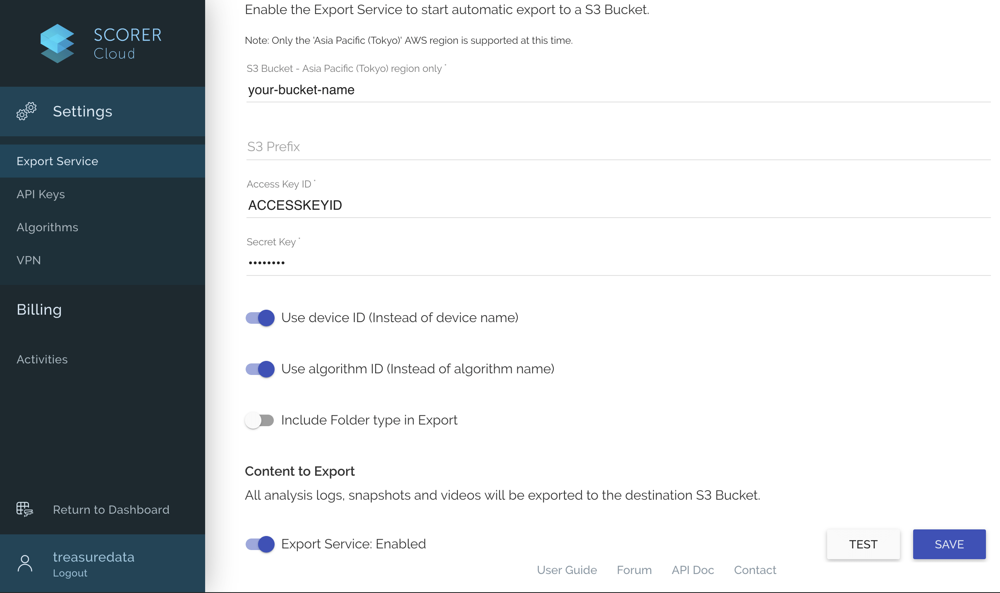
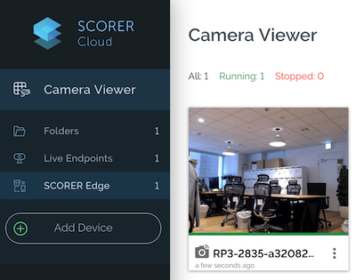
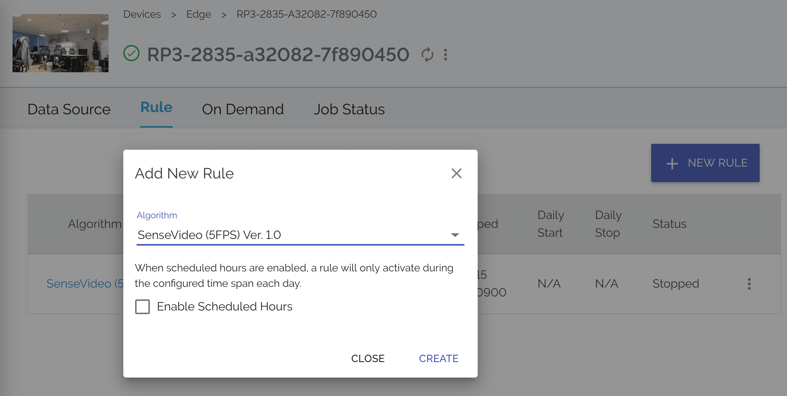
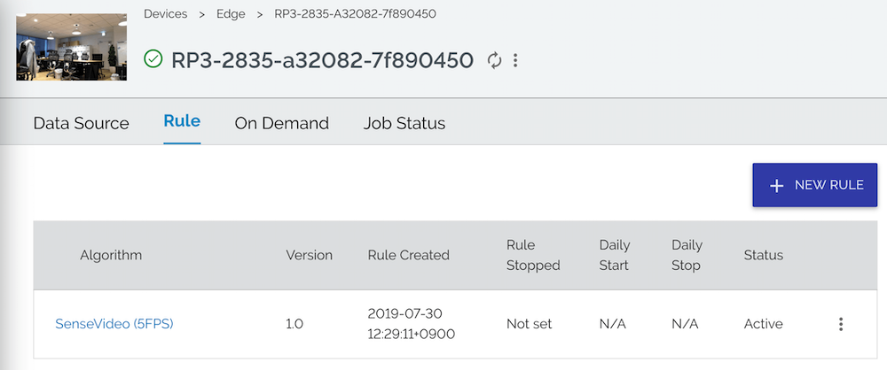

Camera-Based Human Behavior Analysis with SCORER Cloud
===

**[SCORER Cloud](https://sites.google.com/futurestandard.co.jp/en-user-guide/sc)** is a cloud-based video analytics platform that allows us to analyze real-world human behaviors captured on video. This Box introduces a way to integrate the platform with Treasure Data in the following steps:

1. Analyze a video on SCORER Cloud to recognize humans and their demographics.
2. Store the results of video analysis into AWS S3.
3. Periodically pull the data from S3 to Treasure Data.
4. Query the captured data e.g., for counting the number of unique customers in a video.

Eventually, in the context of Customer Data Platform, you will be able to obtain deeper insights into your customers by integrating their digital and physical footprints.

## Requirements

This example assumes you already have the following equipment and user accounts:

- [SCORER Cloud](https://signup.console.scorer.jp/register)
  - Avility to use [SenseVideo algorithm](https://scp.scorer.jp/algorithm.html).
- Video source
  - [SCORER Edge](https://sites.google.com/futurestandard.co.jp/en-user-guide/raspi), in particular.
- AWS S3 bucket in the Asia Pacific (Tokyo) region with the following credentials:
  - Access Key Id: `S3_ACCESS_KEY_ID`
  - Secret Access Key: `S3_SECRET_ACCESS_KEY`
- Treasure Data
  - API Key: `TD_API_KEY`
  - API Endpoint: `TD_API_SERVER`

Note that there is a variety of alternative options for video sources and algorithms, so you can flexibly modify this template for your use cases.

## Preparation

### Configure SCORER Cloud Export Service

Set your AWS S3 bucket name and credentials, and enable Export Service:



### Set up a SCORER Edge device

Connect a SCORER Edge device to a power source and internet, and complete initial configuration:


Make sure if the status is "Running" in the SCORER Edge view:



> SCORER Edge provides an option to immediately analyze a video stream on the Raspberry Pi-based edge device. See [Pedestrian Count with SCORER Edge](../scorer-edge/) for more information.

### Define a rule (algorithm) running for incoming video streams

Select the Running camera viewer, and create a new rule with SenseVideo algorithm:



Check if the rule is activated:



Once everything is properly configured, a video stream is automatically and continuously analyzed by SCORER Cloud, and the results will be stored under the specified S3 bucket prefixed as: `AnalyzedData/Rule/future_standard.sensevideo.1.0/{device_id}/{date}/texts`.

## Deploy Workflow

Update [`config.yml`](./config.yml), and push the workflow with certain secrets:

```sh
td wf push scorer
td wf secrets --project scorer \
              --set td.apikey=${TD_API_KEY} \
              --set td.apiserver=${TD_API_SERVER} \
              --set s3.access_key_id=${S3_ACCESS_KEY_ID} \
              --set s3.secret_access_key=${S3_SECRET_ACCESS_KEY}
```

When `schedule>` section of the `.dig` file is configured as `daily>: 00:00:00`, the workflow automatically pulls the data created by SCORER Cloud from S3 every day at midnight. 

Verify if the workflow runs correctly:

```sh
td wf start scorer scorer --session now
```

## Sample Application: Counting Number of Unique Person

Once the results are copied to Treasure Data, we can build various applications on top of that. 

To give an example, for individual pair of estimated demographics, following query counts number of unique person in a video with 1-day time interval:

```sql
with people as (
  select
    date_parse(datetime, '%Y-%m-%d %T.%f') as datetime,
    uid,
    json_parse(attributes) as attributes
  from 
    sense_video
  where
    type = 1 -- pedestrian
    and confidence > 0.9
)
select 
  json_extract_scalar(attributes, '$.Age') as age, 
  json_extract_scalar(attributes, '$.Gender') as gender,
  count(distinct uid) as num_unique_person_today
from 
  people
where 
  TD_INTERVAL(to_unixtime(datetime), '1d', 'JST')
  and cast(json_extract(attributes, '$.AgeConf') as double) > 0.9
  and cast(json_extract(attributes, '$.GenderConf') as double) > 0.9
group by 
  1, 2
```

See [documentation](https://support.treasuredata.com/hc/en-us/articles/360001450828-Supported-Presto-and-TD-Functions#TD_INTERVAL) to learn more about `TD_INTERVAL`.

Output can be:

| age | gender | num_unique_person_today |
|:---:|:---:|---:|
|Adult|Female|7|
|Adult|Male|30|
|Old|Male|1|
