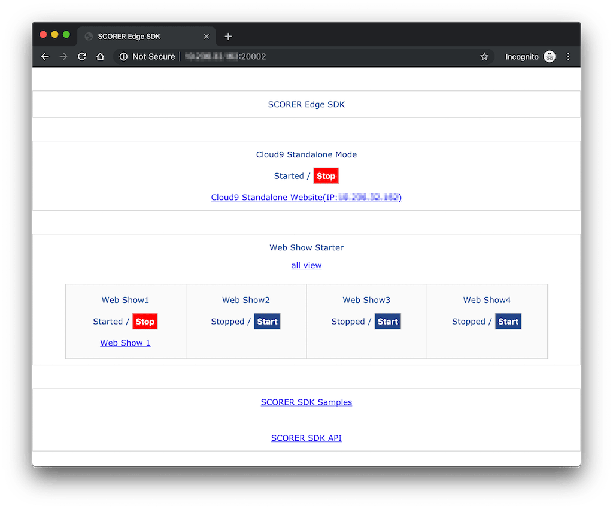
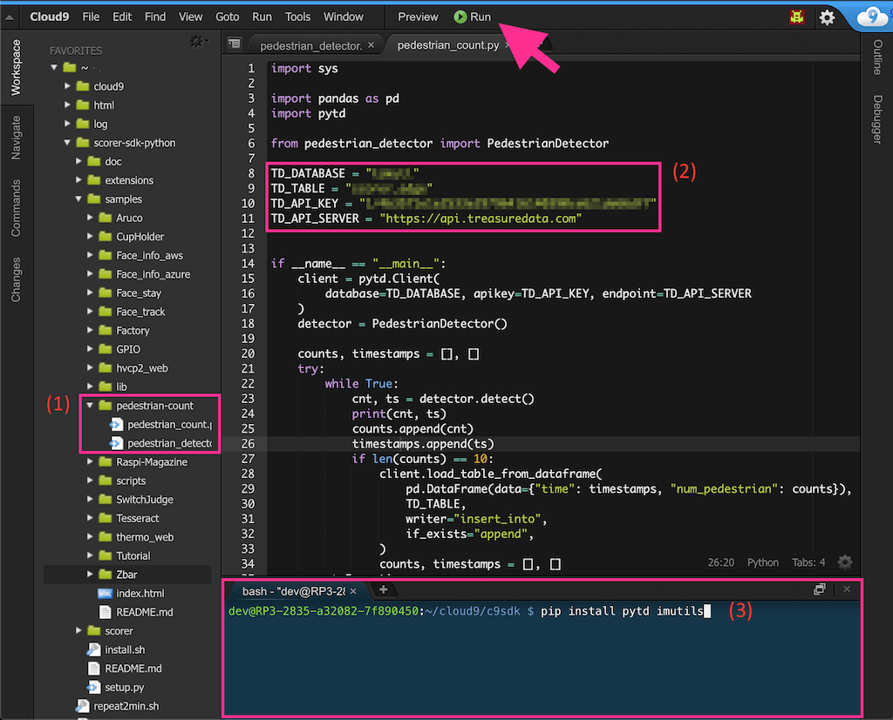
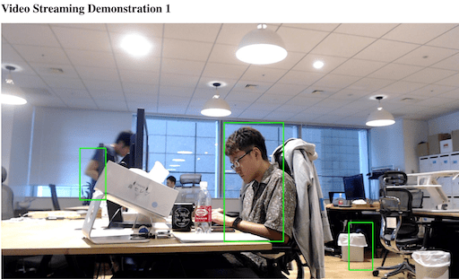

Pedestrian Count with SCORER Edge
===

**[SCORER Edge](https://sites.google.com/futurestandard.co.jp/en-user-guide/raspi)** is a Raspberry Pi-based camera device that enables you to easily capture and analyze video stream on the edge. By using SCORER Edge SDK, this Box demonstrates a sample application which conducts edge-side video analysis and ingests the results to Treasure Data.

## Usage

### Launch SCORER Edge SDK

First and foremost, make sure if the edge device is properly connected to the internet, and SDK console is accessible from your development environment. See [SCORER official documentation](https://sites.google.com/futurestandard.co.jp/en-user-guide/raspi/sdk) for the details.

Once you become able to access to the console under port `20002`, hit `Start` buttons for *Cloud9 Standalone Mode* and *Web Show 1* to proceed:



### Install sample Python scripts in standalone Cloud9 instance

In the SDK console, use sample application provided by this Box as follows:

1. Open *Cloud9 Standalone Website* from the console, and copy the `pedestrian-count/` folder in this Box to `~/scorer-sdk-python/samples/`.
2. Set your database and table name, and Treasure Data API key in [`pedestrian_count.py`](pedestrian-count/pedestrian_count.py).
3. In the shell console, install [`pytd`](https://github.com/treasure-data/pytd/), Treasure Data official Python client, and [`imutils`](https://github.com/jrosebr1/imutils), a collection of basic image processing techniques:
    ```sh
    pip install --user pytd imutils
    ```



Notice that SCORER Edge SDK allows you to seamlessly run image processing code using OpenCV on the edge. Our pedestrian detection example refers: [Pedestrian Detection OpenCV - PyImageSearch](https://www.pyimagesearch.com/2015/11/09/pedestrian-detection-opencv/), for example. 

Hit the *Run* button pointed in the above figure to start continuous video analysis and ingestion. The latest result will be displayed in *Web Show 1* which is accessible from: `http://[SCORER Edge IP address]:5001/`

### Analyze the results on Treasure Data

By default, the application running on Cloud9 sends the records to Treasure Data for every 10 video frames. Eventually, you should be able to enjoy the data coming from the physical world in the cloud-based big data management platform:


To give an example, in the Treasure Data Presto query engine, following query calculates moving averages of the number of pedestrians over five adjacent records in terms of timestamp:

```sql
select 
  time,
  avg(num_pedestrian) over (
    order by time ROWS BETWEEN 5 PRECEDING AND CURRENT ROW
  ) as moving_avg
from 
  scorer_edge -- your database and table name
order by 
  time
```

|time|moving_avg|
|:---:|:---|
|1566198413|4.666666666666667|
|1566198414|4.5|
|1566198500|4.4|
|1566198500|4.333333333333333|
|1566198500|4.166666666666667|

See [Presto window functions documentation](https://prestodb.github.io/docs/current/functions/window.html) for the detail of sliding window operation.

## Limitations

Since Raspberry Pi is a computationally cheap device, edge-side video analysis on SCORER Edge may pose some limitations in terms of efficiency, accuracy, and richness of the outputs as explained below. 

If you need to go beyond what SCORER Edge SDK can do, consider using [SCORER Cloud](../scorer-cloud/) instead.

### Processing time per frame

Our pedestrian detection code employes [the HOG descriptor for people detection](https://sites.google.com/futurestandard.co.jp/en-user-guide/raspi/devicecontrol/functionlist) and [non-maximum supression](https://www.pyimagesearch.com/2014/11/17/non-maximum-suppression-object-detection-python/). Importantly, these techniques are sequentially applied to every single video frame, and hence we need to wait some seconds for analyzing an image. It means that incoming video frames are being queued in a loop of video analysis.

To make the running time per frame shorter, modify [pedestrian_detector.py](./pedestrian-count/pedestrian_detector.py) with alternative image processing techniques, or visit [SCORER Edge Device Control View](https://sites.google.com/futurestandard.co.jp/en-user-guide/raspi/devicecontrol/functionlist) for setting more lightweight options to the configuration of input data such as lower resolution and frame rates.

It should be noticed that there is always a trade-off between the quality of input image and detection accuracy.

### Accuracy of pedestrian detection

Depending on the configuration of SCORER Edge (e.g., resolution, frame rates, place in a room, lighting condition) and choice of image processing algorithms, the results are likely to become inaccurate.

For instance, here is an example of *Web Show 1* illustrated as a result of running this Box on the standalone Cloud9 instance, and sitting person and trash can are wrongly recognized as "pedestrian":



### Richness of output

Bear in mind that output from our edge-side detection code is simpler than [the one from the cloud-based video analysis](../scorer-cloud/); the former only counts up the number of people, and the latter additionally estimates their demographics.

In the context of computer vision, sophisticated output usually requires using a complicated, computationally expensive technique, and it might not fit the capability of the Raspberry Pi-based lightweight camera device. Choose an appropriate option (or, even hybridize the implementation) based on your requirements under the trade-off.