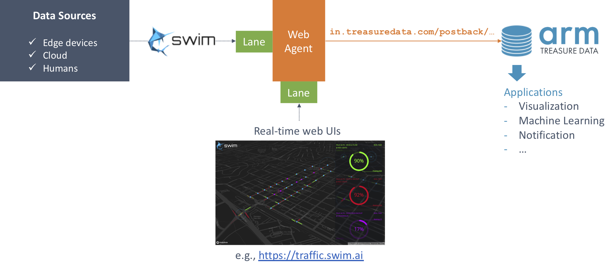

# swimOS: Using Treasure Data with Real-Time Streaming Applications

**[Swim](https://www.swim.ai)** is a platform that allows us to easily build real-time streaming application at scale, and **[swimOS](https://github.com/swimos)** is its OSS offering.

## Overview

This Box demonstrates a way to ingest streaming data from Java-based Swim applications to Treasure Data:



This way, you can gain insights not only in real-time by Swim but also in a batch manner by collecting data in the cloud and analyzing it in combination with a variety of external data sources. This hybrid system enables building a wider range of applications based on your streaming data such as a custom dashboard.

## Usage

[`patch-tutorial.diff`](./patch-tutorial.diff) adds code fragments to the definition of *Web Agent,* which indicates an interconnected, distributed object of Swim applications, in [swimos/tutorial](https://github.com/swimos/tutorial): 

```sh
cd tutorial/server
git apply ../../patch-tutorial.diff
# set values to TD_WRITE_KEY, TD_DATABASE, TD_TABLE variables
```

By running the Swim application, a mock data source publishes random records (e.g., `{'foo': 62, 'bar': 126, 'baz': 174}`) to a Web Agent, and the agent passes the records to [Treasure Data Postback API](https://support.treasuredata.com/hc/en-us/articles/360000675487-Postback-API) along with setting value to the other [Lanes](https://developer.swim.ai/concepts/lanes/):

```sh
./gradlew run
```

```
> Task :run
Running Tutorial plane...
[/unit/master] Hello, world!
[/unit/master] publish: commanded with {foo:60,bar:106,baz:198}
[/unit/master] latest: set to {foo:60,bar:106,baz:198} from
[/unit/master] history: appended {0, {1574293480492,{foo:60,bar:106,baz:198}}}
[/unit/master] histogram: replaced 1574293480000's value to {count:2} from
[/unit/master] Sending POST request to: https://in.treasuredata.com/postback/v3/event/DATABASE_NAME/TABLE_NAME
[/unit/master] Data: {"time":1574293480534,"foo":60,"bar":106,"baz":198}
[/unit/master] Response code: 200
[/unit/master] publish: commanded with {foo:58,bar:134,baz:188}
[/unit/master] latest: set to {foo:58,bar:134,baz:188} from {foo:60,bar:106,baz:198}
[/unit/master] history: appended {1, {1574293481172,{foo:58,bar:134,baz:188}}}
[/unit/master] histogram: replaced 1574293480000's value to {count:21} from {count:2}
[/unit/master] Sending POST request to: https://in.treasuredata.com/postback/v3/event/DATABASE_NAME/TABLE_NAME
[/unit/master] Data: {"time":1574293481172,"foo":58,"bar":134,"baz":188}
[/unit/master] Response code: 200
...
```

Eventually, the records become available in a specified Treasure Data table.