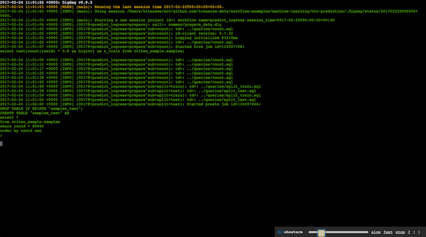
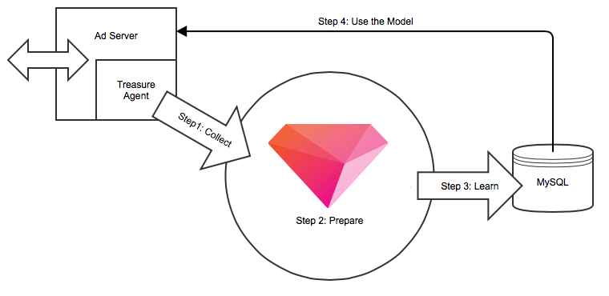

Click-Through-Rate Prediction Template
===

Cost Per Acquisition (CPA) is a key metric that matters to marketers. To reduce costs of online advertising, it is needed to improve **Click-Through-Rate (CTR)**.

Our machine learning solution enables you to predict CTR of each ad session by learning a prediction model from past big data, from millions of attributes and billions of training examples.

## Input

For instance, this workflow takes a table of the following form:

| rowid<br/>`long` | label<br/>`int` | i1<br/>`int` | i2<br/>`int` | ... | c1 (e.g., address) <br/>`string` | c2 (e.g., browser) <br/>`string` | ... |
|:---:|:---:|:---:|:---:|:---:|:---:|:---:|:---:|
| 1 | 0 | 23 | 1 | ... | "Ohio" | "Firefox" | ... |
| 2 | 1 | 18 | 4 | ... | "New York" | "Google Chrome" | ... |
| 3 | 0 | 35 | 44| ... | "California" | "Safari" | ... |
| ... |...|...| ...|...|...|...|...|

Here, each row represents user's single impression for an ad. Impressions can be written by a set of `int` (quantitative) and `string` (categorical) variables such as users' demographics. A column `label` shows whether a user clicked an ad.

> **Note:** This template supports tables which have 13 quantitative (i1-i13) and 26 categorical (c1-c26) variables by default.

If you have more/less quantitative and/or categorical features in a table, you need to modify the following queries appropriately:

- [queries/minmax_train.sql](queries/minmax_train.sql)
- [queries/minmax_test.sql](queries/minmax_test.sql)
- [queries/preprocess_train.sql](queries/preprocess_train.sql)
- [queries/preprocess_test.sql](queries/preprocess_test.sql)

## Workflow

We prepared a basic workflow for CTR prediction:

```sh
$ ./data.sh # prepare data
$ td wf push ctr-prediction # push workflow to TD
$ td wf start ctr-prediction predict_logress --session now -p apikey=${YOUR_TD_API_KEY}
```

* [predict_logress.dig](predict_logress.dig) - TD workflow script for CTR prediction using [Logistic Regression](https://hivemall.incubator.apache.org/userguide/binaryclass/a9a_lr.html)
* [config/general.yml](config/general.yml) - defines configurable parameters for the prediction.

[](http://showterm.io/de1678afb369ad82a04bc)

## Output

The output of workflow is a table that contains predicted CTRs for possible future impressions:

| rowid<br/>`long` | predicted_ctr<br/>`double` |
|:---:|:---:|
|80038 |0.487177|
|80043|0.9583734|
|80046 | 0.9104515 |
| ... | ... |

> **Note:** Output may change every time the workflow is newly executed due to [randomness in shuffling](./queries/shuffle.sql#L5). Use [Hive version](./queries/shuffle_hive.sql) of the query for making the result repeatable with consistent random seed.

## Using the Prediction Model in Production System



Once the prediction workflow has been successfully completed, exporting the prediction model to your own MySQL database is easy:

1. Configure your MySQL DB information in [config/secrets.yml](config/secrets_sample.yml)
2. Load the information to TD workflow:<br/>`$ td wf secrets --project ctr-prediction --set @config/secrets.yml`
3. Export a `logress_model` table to your MySQL DB:<br/>`td wf start ctr-prediction mysql --session now -p apikey=${YOUR_TD_API_KEY}`

> **Note:** Make sure a table `logress_model` exists on your MySQL DB as follows.

```sql
create table logress_model (
  feature varchar(255),
  weight double
);

-- setting index would be better
create unique index logress_model_feature_index on logress_model (feature);
```

That's it. Now, you are ready to predict CTRs for unforeseen impressions.

We prepared some MySQL user-defined-functions (UDFs) in [mysql_udfs.sql](mysql_udfs.sql):

```
mysql> mysql_udfs.sql
```

Prediction for single impression can be done by:

```sql
select
  sigmoid(sum(m.weight * t2.value)) as prob
from
  logress_model m
  left outer join (
    select
      extract_feature(f) as feature,
      extract_value(f) as value
    from (
      select 'i1:23' as f
      union all
      select 'i2:1' as f
      union all
      ...
      union all
      select 'c1#Ohio' as f
      union all
      select 'c2#Firefox' as f
      union all
      ...
    ) t1
  ) t2 on (m.feature = t2.feature)
;
```

In particular, when a user visits to a site, what your ad server needs to do is:

1. Convert all possible ads to sets of quantitative and categorical features.
2. Construct queries as shown above and compute predicted CTRs.
3. Display highest-scored ad(s) to the target user.

Another option is to predict CTRs programmatically by just reading the prediction model from MySQL DB, as demonstrated in the following code snippet:

```ruby
$model = read_model_from_mysql()

def scoring(i, a)
  # list of [feature, value] pairs
  features = [
    # quantitative variables
    ['i0', i.user_generation],
    ['i1', i.user_age],
    ...,
    # categorical features
    ["c1##{i.user_address}", 1.0],
    ["c2##{i.user_browser}", 1.0],
    ["c3##{a.ad_id}", 1.0],
    ["c4##{i.publisher_id}", 1.0],
    ["c5##{a.advertiser_id}", 1.0],
    ["c6##{a.campaign_id}", 1.0],
    ["c7##{a.creative_id}", 1.0],
    ...
  ]

  # compute weighted sum
  features.inject(0) { |sum, f| sum += ($model[f.first] || 0) * f.last }
end

impression = ... # target impression
ads = [ ... ] # list of possible ads
best_performing_ad = ads.map{|ad| [scoring(impression, ad), ad]}.sort.last[1]
```

Further readings:

- [How to Get More Clicks for Digital Advertising: Step by Step Guide to Optimizing CTRs with Real-time Data + Machine Learning](https://blog.treasuredata.com/blog/2014/10/13/how-to-get-more-clicks-for-digital-advertising-step-by-step-guide-to-optimizing-ctrs-with-real-time-data-machine-learning/)
- [Real-time Prediction on RDBMS · Hivemall User Manual](https://hivemall.incubator.apache.org/userguide/tips/rt_prediction.html)

## How This Workflow Works

For further reading for algorithm and/or workflow details, please refer [this page](docs/more.md).

## Conclusion

Treasure Workflow provides an easy way to predict not only CTR but also Conversion Rate (CVR). What you need to prepare is just a training table.

[Contact us](https://www.treasuredata.com/contact_us) if you interested in [our paid consulting service](https://docs.treasuredata.com/display/public/PD/Consultation).
