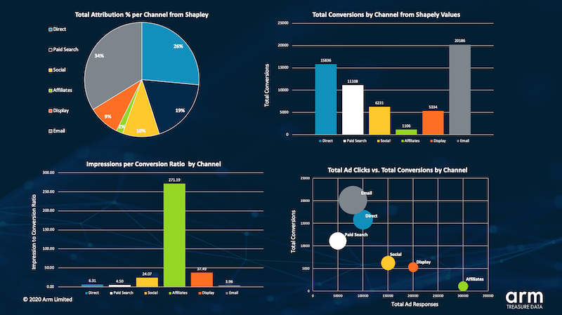
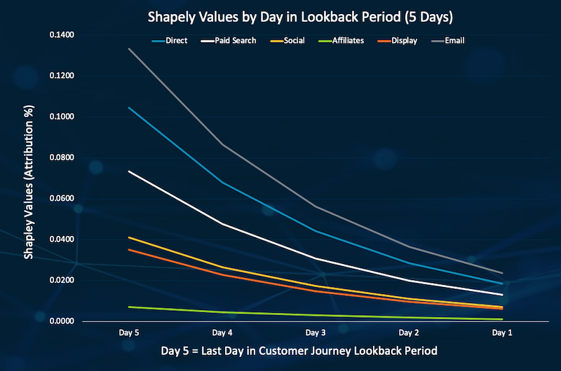

Data-Driven Multi-Touch Attribution
===

This Box provides a data-driven, machine learning-based templatized solution for **[Multi-Touch Attribution](https://en.wikipedia.org/wiki/Attribution_(marketing))** (MTA), running on your pageview data stored in Treasure Data. 

Unlike traditional rule-based MTA solutions such as first-touch and last-touch model, our template takes an advanced machine learning-based approach to accurately model customer's path to conversion and understand better about how/why marketing touchpoints bring your customer to the goal. Eventually, the insights enable you to effectively and efficiently optimize the marketing campaigns with optimal budget allocation.

The implementation is based on a [state-of-the-art academic paper](https://arxiv.org/abs/1902.00215) employing a Deep Learning technique, and one of the key concepts used in the technique is called the [Shapley value](https://en.wikipedia.org/wiki/Shapley_value) calculation. The overall performance of this template has been proven on the Treasure Data platform with some of our real datasets.

The template ultimately generates deeper insights about conversion histories and allows you to build the following dashboard, for example:



## Input

Assume we have a following [`touchpoints`](https://gist.github.com/takuti/c890cdcbae7946f21a0afc3a4d88ec9f) table that collects user behaviors and conversion events with their sources (i.e., marketing channels):

| `time` | `user_id` | `source` | `conversion` |
|:---:|:---:|:---:|:---:|
| 1596012307 | yl38g61s2x | sfmc | 0 |
| 1596012340 | d4dbvpwcyj | instagram | 0 |
| 1596012427 | egeaf1po46 | facebook | 0 |
| 1596012553 | gls9vyk2de | google | 1 |
| 1596012645 | ps6cc25f24 | instagram | 0 |
| ... | ... | ...| ... |


If you have a `pageviews` table collected by [td-js-sdk](https://github.com/treasure-data/td-js-sdk), preprocess the records in advance and parse `td_url` & `td_referrer` for extracting source channel of every single touchpoint. A query snippet below is an example of how to extract a variety of sources from the `pageviews` data:

```sql
select
  ${time_col},
  ${unique_id},
  (
    CASE
      WHEN url_extract_parameter(td_url, 'utm_source') IS NULL THEN (
        CASE
          WHEN regexp_like(td_referrer, 'google.co') THEN 'google'
          WHEN regexp_like(td_referrer, 'instagram') THEN 'instagram'
          WHEN regexp_like(td_referrer, 'facebook') THEN 'facebook'
          WHEN regexp_like(td_referrer, 'youtube') THEN 'youtube'
          WHEN regexp_like(td_referrer, 'twitter') THEN 'twitter'
          WHEN regexp_like(td_referrer, 'linkedin') THEN 'linkedin'
          -- ... (as many possible sources as you want)
          ELSE 'direct & others'
        END
      )
      ELSE url_extract_parameter(td_url, 'utm_source')
    END
  ) as ${source_col} ,
  -- ... (assign 0 or 1 depending on your definition of "conversion")
    as ${conversion_col}
from
  pageviews
where
  TD_INTERVAL(${time_col}, '-30d') -- last 30 days, for example
```

## Workflow

```sh
# Push workflow to TD
$ td wf push mta

# Set secrets from STDIN like: td.apikey=1/xxxxx, td.apiserver=https://api.treasuredata.com
$ td workflow secrets \
  --project mta \
  --set td.apikey \
  --set td.apiserver

$ td wf start mta mta_shapley --session now
```

By default, the workflow automatically imports a dummy dataset to `mta_sample.touchpoints`. Edit [`config/params.yml`](./config/params.yml) if you use your own dataset. 

Meanwhile, [`config/model.json`](./config/model.json) enables you to further customize the model. See [`docs/more.md`](./docs/more.md) for more information about the advanced config parameters.

## Output

Eventually, three tables are derived as a result of successful workflow execution.

### Table: `metrics`

| `loss` | `rmse` | `val_loss` | `val_rmse` |
|:---|:---|:---|:---|
|0.49751710891723633|0.4046436846256256|0.6924436688423157|0.499650239944458|
|0.42745542526245117|0.37608763575553894|0.6913946270942688|0.4991241991519928|
|0.3927740454673767|0.3654404878616333|0.6890262365341187|0.4979383051395416|

The table contains evaluation metrics obtained from the training and validation process. A single row corresponds to a single epoch, and `loss` / `rmse` and `val_loss` / `val_rmse` are respectively represent the values for training and validation. 

Check if `val_loss` or `val_rmse` stop decreasing and start getting bigger; next time, you might want to stop the model training at a specific epoch. You also want to make sure there is not a huge difference between training and validation metrics, because such a gap might point to model overfitting. 

### Table: `shapley`

| `instagram` | `google` | `sfmc` | `facebook` | `direct` | `days_before_conversion` |
|:---|:---|:---|:---|:---|:---|
|-0.0010403504129499197|-0.004529354628175497|-0.0004913342418149114|-0.004142973572015762|-0.0002199627342633903|2|
|-0.0007449646363966167|-0.006828240118920803|-0.000607220979873091|-0.00694135669618845|-0.0003867909254040569|1|
|0.18350449204444885|0.34311071038246155|0.08801353722810745|0.33066612482070923|0.08063764125108719|0|

This is the main table we've all been waiting for. The number of rows is equal to the number of lookback days that we chose in [`config/params.yml`](./config/params.yml). 

In a column called `days_before_conversion`, `0` indicates, for example, the effect of each channel on the conversion events when users are exposed to a channel in less than 24 hours before their conversion. Going up the day's index, you will see how Shapley values and attribution percentages change at farther touchpoints from the final conversion event. 

By visualizing the values as follows, this table gives insights into how different channels perform throughout the customer journey to conversion and which ones are more effective as a first-touch vs. last-touch on that journey.



### Table: `shapley_channel`

| `instagram` | `google` | `sfmc` | `facebook` | `direct` |
|:---|:---|:---|:---|:---|
|0.18171918392181396|0.33175310492515564|0.08691497892141342|0.3195818066596985|0.0800308883190155|

This table has the aggregate Shapley values summed across all days of the lookback window. These values can be considered as the total attribution percentage that each channel should be assigned towards conversions. 

## How this workflow works

For further reading for algorithm and workflow details, refer [`docs/more.md`](./docs/more.md).

## Want to learn more & try on your data?

The model is fully customizable for your data depending on your own definition of conversion. Contact your Customer Success Representative if you are interested in building and testing the advanced MTA solution.