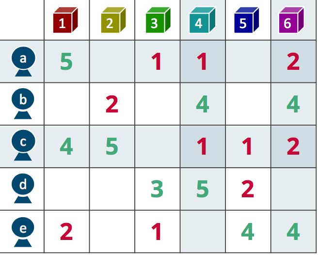
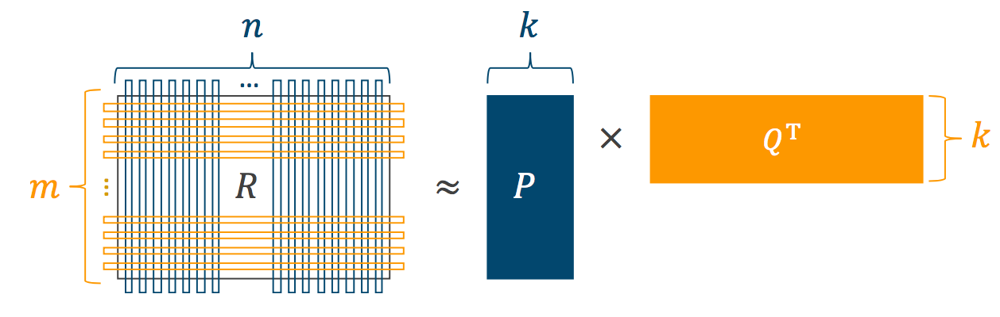

After you read this page, you can:

- get a basic understanding of a recommendation technique,
- understand basic usage of [Treasure Workflow](https://docs.treasuredata.com/display/public/PD/Workflows+and+Machine+Learning) for a recommendation purpose,
- try the template on publicly available data,
- make recommendation on your own data stored in TD.

## How to generate recommendations

Let you first imagine a simple user-item-rating matrix:

| userid | itemid | rating |
|:---:|:---:|:---:|
| ...|...|...|
| d | 3 | 3.0 |
| a | 1 | 5.0 |
| c | 5 | 1.0 |
| ... | ... | ... |

Each row corresponds to a user's rating event for an item, and a value `rating` now indicates a 5-level user's feedback; we can assume that user **c** probably dislikes item **5**, and user **a** likes item **1**. 

Here is a question: "Does user **a** likes item **5**?" Essentially, **recommendation** is a way to find a solution for the question. 

To give an example, e-commerce services such as Amazon.com obviously have such rating data, and they somehow provide recommendation like "customers who bought this also bought..." based on the histories.

To be more precise, recommendation based on the user-item-rating tables internally consists of two steps: 

- (1) rating prediction, and 
- (2) recommendation.

### (1) Rating prediction

Let us get back to the question: "Does user **a** like item **5**?" This means that our table does not have a row like:

| userid | itemid | rating |
|:---:|:---:|:---:|
| a | 5 | ? |

Thus, in order to measure how user **a** is likely to prefer item **5**, we need to **predict** a missing rating for the user-item pair. This is the first step for making recommendation.

### (2) Recommendation

Once missing ratings are predicted, we can select most promising items for each user. 

In case that user **a** gets the following predictions, one of the most promising items that the user prefers is obvious.

| userid | itemid | (predicted) <br> rating |
|:---:|:---:|:---:|
| a | 2 | 5.0 |
| a | 5 | 1.5 |
| a | 9 | 2.0 |

We can infer that "user **a** probably prefers item **2**," and hence we reasonably recommend item **2** to the user.

### More about algorithmic aspect: Matrix Factorization

In the first example using Treasure Workflow, we internally used a well-known recommendation technique called **Matrix Factorization** (MF). This technique considers the user-item-rating histories (i.e., table) as a matrix:



Now, there are many missing values we need to predict.

MF applies a mathematical operation for the matrix. If we call the original matrix as ***R***, MF breaks up it into two smaller matrices, ***P*** and ***Q***:



This means that MF captures users' (row-wise) and item (column-wise) characteristics in the original matrix.

By just computing matrix multiplication of ***P*** and ***Q***, we can obtain predictions for all missing ratings.

## What the workflow did

### Data format

We are now assuming you already have a user-item-rating table as an input:

|| userid | itemid | rating |
|:--:|:---:|:---:|:---:|
|**type**| long |long|double|

It should be noted that a column `rating` can be used for not only actual "ratings" but also a wide variety of real-valued data such as number of accesses and purchases.

Unlike the previous example, user and item IDs are long values. If your user/item IDs are not long, run `map_id.dig` and create intermediate mapping tables for users and items:

```
$ td wf start recommendation map_id --session now -p apikey=${YOUR_TD_API_KEY}
```

In order to map the original user/item IDs to unique long values, the workflow creates new tables, `users` and `items`, on TD as:

|| userid_original | userid |
|:--:|:---:|:---:|
|**type**| *non-long* |long|

|| itemid_original | itemid |
|:--:|:---:|:---:|
|**type**| *non-long* |long|

You can use these intermediate tables to generate a user-item-rating matrix in an appropriate format.

### Tasks

Here, let us see `recommend.dig`, the workflow we demonstrated at the beginning `$ td wf start ...`. This workflow basically follows several sub-steps to make recommendation on TD:

1. Split rows in the original table into **80% training** and **20% testing** rows.
2. Build a recommendation model for the 80% training data; that is, apply the MF technique for a training user-item-rating matrix.
3. Predict ratings for missing user-item pairs based on matrix multiplication.
4. For each user, select top-k highest-predicted items as a recommendation list.

The content of `recommend.dig` is:

```yml
_export:
  !include : config/params.yml
  td:
    apikey: ${apikey}
    database: ${target}
    engine: hive

# Step 1
+prepare:
  call>: common/prepare_data.dig

+main:
  +mean:
    td>: queries/compute_mean.sql
    store_last_results: true
    engine: presto

  # Step 2
  +mf_train:
    td>: queries/mf_train.sql
    create_table: mf_model

  # Step 3 and 4
  +top_k:
    td>: queries/top_k.sql

  +recommend:
    td>: queries/recommend.sql
    create_table: recommendation
```

### Configurable parameters

It should be noticed that our workflow loaded external file `config/params.yml`. This file describes several parameters that we need to choose before launching MF:

```yml
# Data:
source: movielens.ratings # input table
target: movielens # output database

# Parameters for Matrix Factoriszation:

# (1) Number of latent factors
# - too large => high prediction accuracy, but more time-consuming
# - too small => efficient, but low prediction accuracy
factor: 20

# (2) Regularization parameter
# - too large or small
#   => negative effect to prediction, fail into meaningless prediction
lambda: 0.01

# (3) Learning rate
# - too large => negative effect to prediction
# - too small => take much more time
eta: 0.01

# (4) Number of iterations
# - affect to running time in case of
#   bad regularization parameter and/or learning rate
# - set reasonably large value in general
iter: 50

# Recommendation size:
k: 10
```


### Evaluating the accuracy of recommendation

We separated the data into 80% training and 20% testing samples. Thus, in Step 3, the accuracy of prediction can be measured by using the testing samples. 

There are two different metrics: **[Root Mean Squared Error](https://en.wikipedia.org/wiki/Root-mean-square_deviation)** (RMSE) and **[Mean Absolute Error](https://en.wikipedia.org/wiki/Mean_absolute_error)** (MAE). Both metrics return a real value which shows the degree of accuracy; smaller RMSE and MAE are better.

Following `predict.dig` workflow runs this evaluation procedure after splitting training and testing samples:

```
$ td wf start recommendation predict --session now -p apikey={YOUR_API_KEY}
```

If everything works correctly, you eventually gets the following output:

```
MAE: 0.6071743616791809, RMSE: 0.7936881199181349
```

This output indicates that, on your testing data, prediction errors are roughly around 0.7. Since our current data is 5-level ratings, this result is reasonably small and good.

If you are not satisfied with the accuracy, you can try the same workflow with different parameters. It should be easy by modifying `config/params.yml`. 

Note that a `--goal +main` option skips the train-test splitting step; we do not need to re-run the step every time.

## Data preparation

So far, we used [MovieLens 1M Dataset](https://grouplens.org/datasets/movielens/1m/), one of the most famous public data for recommendation.

You can get and prepare the data by:

```
$ ./data.sh
```

Check a `ratings` table on a `movielens` database:

| userid | itemid | rating |timestamp|
|---:|---:|:---:|:---:|
| ... |...|...|...|
|3077|2046|4.0|969831084|
|3078|1252|4.0|994431497|
|3078|736|1.0|969817761|
| ... |...|...|...|

You notice that the MovieLens data has time-stamped 5-level rating events.

Finally, source table and target database can be manually configured in `config/params.yml` as:

```yml
# Data:
source: source_db.table_name # input table
target: target_db # output database
```

That's it. Now, you can try the workflow:

```
$ td wf start recommendation recommend --session now -p apikey={YOUR_API_KEY}
```