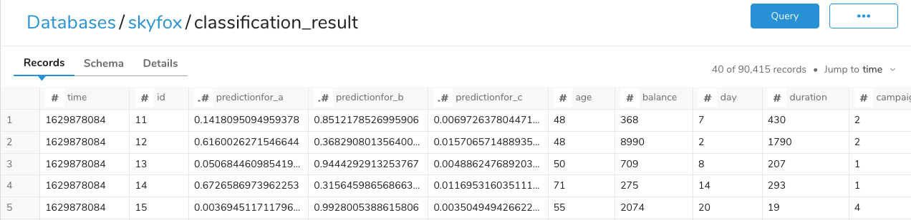
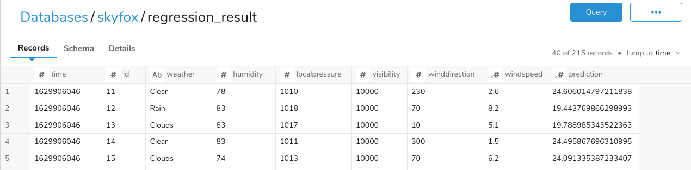

# Integration with SkyFox
[Skyfox](https://skyfox.ai/) is an AutoML service offered by [SecondXight](https://www.sxi.co.jp/).
This directory includes some workflows to 
1. train models with a table in Treasure Data
2. predict results and put them on Treasure Data

## Workflows

### Prerequisite
Skyfox requires AWS S3 to train models and predict with models. You have to prepare AWS S3.

### Configuration
Following workflows require to set [config/common.yml](./config/common.yml) with your environment and secret variables.

#### config/common.yml
|Key|Description|Sample|
|--|--|--|--|
|td.database|Database name to put sample data|skyfox|
|td.endpoint|An endpoint of your Treasure Data|api.treasuredata.com|
|s3.bucket|Your S3 bucket name|api.treasuredata.com|
|skyfox.auth_endpoint|Skyfox's endpoint for authentication|sandbox-users-api.skyfox.ai|
|skyfox.endpoint|Skyfox's endpoint except for authentication| sandbox-api.skyfox.ai|

#### Secret variables
|Key|Description|Sample|
|--|--|--|--|
|td.apikey|Master API Key of Treasure Data|1/xxxxxxxxxxxxxx|
|skyfox.username|User name of Skyfox|skyfox_user|
|skyfox.password|Password of Skyfox|skyfox_password|
|s3.awsAccessKeyId|Access Key ID accessible to AWS S3|AXXXXXXXXXXXXZ|
|s3.awsSecretAccessKey|Secret Access Key ID accessible to AWS S3|axxxxxxxxxxxxxxxxxxxxxxxxxz|

You can use this command to set secret variables.
```
td workflow secrets --project "YOUR PROJECT" --set td.apikey skyfox.username skyfox.password s3.awsAccessKeyId s3.awsSecretAccessKey
```

### [ingest.dig](./ingest.dig)
This workflow creates tables with sample data for following workflows.

### [classification.dig](./classification.dig)
This workflow trains a classification model with sample data ingested by [ingest.dig](./ingest.dig).
It requires you to set [config/classification.yml](./config/classification.yml).

|Key|Description|Sample|
|--|--|--|--|
|s3.path_prefix_train|Object key on AWS S3 to export training data|skyfox/classification_train.csv|
|s3.path_prefix_predict|Object key on AWS S3 to export prediction data|skyfox/classification_pred.csv|
|td.dest_database|A database name of Treasure Data to create a result table|skyfox|
|td.dest_table|A table name of Treasure Data to create a result table|classification_result|
|skyfox.target_variable|A table variable to predict|rank|

Once completing, you can get a table like below image.


### [regression.dig](./regression.dig)
This workflow trains a regression model with sample data ingested by [ingest.dig](./ingest.dig).
It requires you to set [config/regression.yml](./config/regression.yml).

|Key|Description|Sample|
|--|--|--|--|
|s3.path_prefix_train|Object key on AWS S3 to export training data|skyfox/classification_train.csv|
|s3.path_prefix_predict|Object key on AWS S3 to export prediction data|skyfox/classification_pred.csv|
|td.dest_database|A database name of Treasure Data to create a result table|skyfox|
|td.dest_table|A table name of Treasure Data to create a result table|classification_result|
|skyfox.target_variable|A table variable to predict|temperature|

Once completing, you can get a table like below image.

