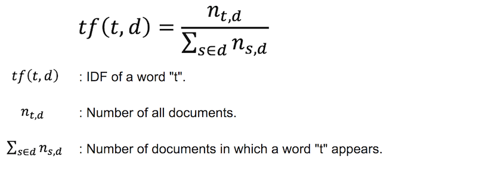
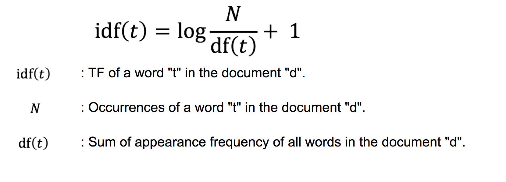

## What is TF-IDF


TF-IDF stands for "Term Frequency, Inverse Document Frequency". It is a way to score the importance of words (or "terms") in a document based on how frequently they appear across multiple documents.

If a word appears frequently in a document, it's important. Give the word a high score.
TF represents the frequency of occurrence of each word in the document.



But if a word appears in many documents, it's not a unique identifier. Give the word a low score.
DF indicates how many documents each word is used in common.
As the name implies, IDF is the inverse of DF.
In order to reduce the change in the value according to the number of documents, it takes logarithm.



In the IDF, 1 is added so that the minimum value does not become 0.

If we multiply TF and IDF as the weight of a word, the larger the value, the more it can be said that it is a word that characterizes each document.

## What the workflow did

### Data Format

We are now assuming you already have a docid-contents table as an input:

|| docid | contents |
|:--:|:---:|:---:
|**type**| long |string|

If your own table does not have docid colmun or your docid is not long, you should create new table with `row_number` function as below:

```sql
select
  *,
  row_number() over () as docid
from
  yourtable
```

### Tasks

Here, let us see `tfidf.dig`, the workflow we demonstrated at the beginning `$ td wf start ...`. This workflow basically follows several sub-steps to get output tables on TD:

1. Explode the documents.
1. Calculate tfidf. 
1. Create output tables.
	1. Collect tfidf of each document and word. 
	1. Select top-k important keywords for each document.

The content of `tfidf.dig` is:

```yml
_export:
  !include : config/params.yml
  td:
    apikey: ${apikey}
    database: ${target}
    engine: hive

# Step1
+explode:
  _parallel: true

  +if_english:
    if>: ${english}
    _do:
      td>: queries/explode.sql
      create_table: exploded

  +if_japanese:
    if>: ${japanese}
    _do:
      td>: queries/explode_japanese.sql
      create_table: exploded

+count:
  td>: queries/count.sql
  store_last_results: true
  engine: presto

# Step 2
+main:
  td>: queries/tfidf.sql
  create_table: tfidf

# Step 3
+output:
  _parallel: true

  # Step 3-ⅰ
  +collect:
    td>: queries/collect.sql
    create_table: collected

  # Step 3-ⅱ
  +top_k:
    td>: queries/top_k.sql
    create_table: top_k
```

After Step 2, tfidf for each word in each document are stored in `tfidf`:

| docid | word | tfidf |
|:---:|:---:|:---:|
| 1 | fairness | 0.03516955.. |
| 1 | ethics | 0.03516955.. |
| 1 | equity | 0.03516955.. |
| ... | ... | ... |
| 2 | experience | 0.01729545.. |
| 2 | seeking | 0.02172237.. |
| ... | ... | ... | 

### Configurable parameters

It should be noticed that our workflow loaded external file `config/params.yml`. This file describes several parameters that we need to choose before launching TF-IDF:

```yml
# Data:
source: tfidf.wikipage # input table
target: tfidf # output database
stopwords: stopwords.stopwords # stopwrods table

# language of documents
# if english => english: true, japanese: false
# if japanese => english: false, japanese: true
english: true
japanese: false

# Top k keywords for each document
k: 3
```

## Data preparation

So far, we used a sample table `tfidf.wikipage` as data source. This dataset consists of three documents which are the Wikipedia entries of Justice, Wisdom, and Knowledge, respectively.

We prepared a script which enables you to easily get and import the data:

```sh
$ sh sh/data.sh
```

And as written in the [document](../README.md), This workflow presupposes the existence of stopwords table. We can use general english and japanese [stopword list](../stopwords/stopwords.csv).

We prepared a script which enables you to easily import the list:

```sh
$ sh sh/stopwords.sh
```

Finally, source table, target database and stopwords table can be manually configured in `config/params.yml` as:

```yml
# Data:
source: source_db.table_name # input table
target: target_db # output database
stopwords: source_stopwords_db.stopwords_table_name # stopwrods table

```

That's it. Now, you can try the workflow:

```sh
$ td wf push tfidf # push workflow to TD
$ td wf start tfidf tfidf --session now -p apikey={YOUR_API_KEY}
```
