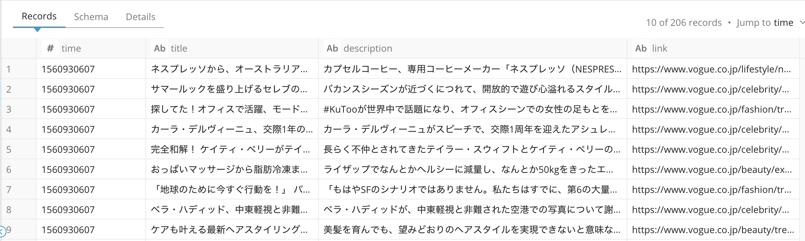

# Get RSS feed data and import it to a table 
This workflow gets RSS feed data from web sites you specified and import data to a table. RSS data usually includes contets of web articles. You can utilize those data by tokenize and keyword tagging to users with scores combined with user web activities, for example.

## How to use
### Push workflow and set secret
Download this workflow and push it to your TD environment, then set your td master api key as secret on the project.
```
$ td wf push rss_import
$ td wf secrets --project rss_import --set td.apikey
```
### Set RSS url list
Set rss_url_list you want to get imported in [rss_import.dig](rss_import.dig) file.
Here is example.
```
  rss_url_list: ['https://www.vogue.co.jp/rss/vogue', 'https://feeds.dailyfeed.jp/feed/s/7/887.rss']
```

### Prepare database and table
You need to have following database and table to which data are imported. 
```
$ td db:create rss_db
$ td table:create rss_db rss_tbl
```
If you want to change name, you need to modify following settings in [rss_import.dig](rss_import.dig) file accordingly.
```
  dest_db: rss_db
  dest_table: rss_tbl
  ```

### Schedule
You can schedule the workflow with any interval by changing following schedule setting in [rss_import.dig](rss_import.dig) file (set it daily in default).
```
timezone: Asia/Tokyo

schedule:
  daily>: 02:00:00
```

### TD endpoint
You need to modify td_endpoint setting in [rss_import.dig](rss_import.dig) file for your TD region accordingly. See our [document](https://support.treasuredata.com/hc/en-us/articles/360001474288-Sites-and-Endpoints#Endpoints) for details.
```
    td_endpoint: "https://api.treasuredata.com/"
```

## Output
You can see imported data in rss_db.rss_tbl.

