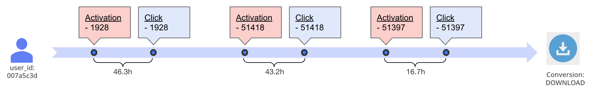
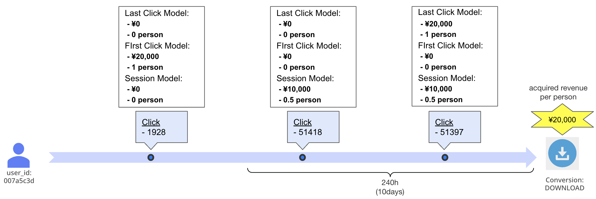
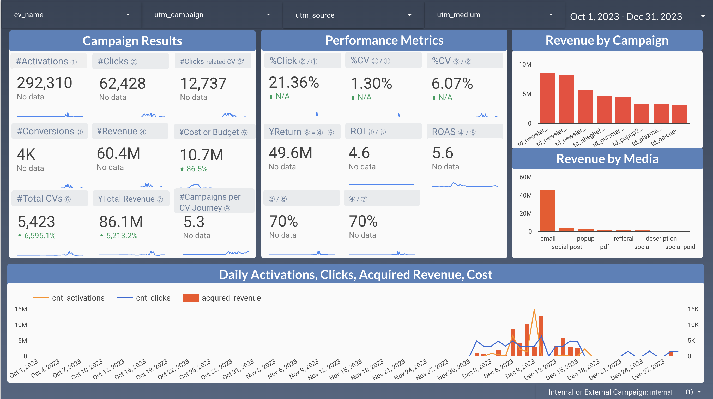
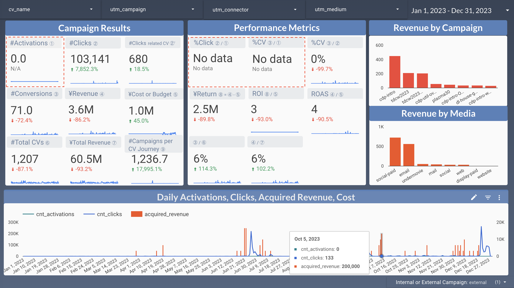

# CDP Campaign Management

## Overview

This WF is used to measure campaign effectiveness for each activation performed on Journey Orchestration. The revenue generated by each activation can be calculated using Multi Touch Attribution, allowing for the calculation of ROI.


Please be sure to read the slide: [How to measure the effectiveness of TD campaigns](https://docs.google.com/presentation/d/e/2PACX-1vRTQ2YhgXuEKQ7SDn-l-xAHCMW6L4NF2AhXHlP6ADz1vU7hRDPLwxk8hajFGObkq_t08WyMHLqNPgRk/embed) first before proceeding with this document.

## Requirements

### Monitoring WFs

Before installing this WF, it is assumed that the Monitoring WFs has been installed. the Monitoring WF consists of the following 3 WF groups, all of which need to be installed.

- [basic_monitoring](https://github.com/treasure-data/treasure-boxes/tree/master/scenarios/monitoring/basic_monitoring)
- [cdp_monitoring](https://github.com/treasure-data/treasure-boxes/tree/master/scenarios/monitoring/cdp_monitoring)
- [workflow_monitoring](https://github.com/treasure-data/treasure-boxes/tree/master/scenarios/monitoring/workflow_monitoring)

### Required CDP Features

#### Journey Orchestration

(required)
Currently, only activations performed on Journey Orchestration are tracked. In other words, activations from segments are not tracked.

#### activation_log

(optional)
activation_log is an option to record in the TD a history of who, when, and where all activations were made. When this history is available, it will be easy to refer to the activation history for each user.

If this table is not available, you can still scan the journey table to create an activation history, but you will need Custom Scripts.

## Main Output Tables

The `cdp_campaigns_${ps_id}` is automatically created and the following tables are output.

| Table | Utilized in AS? | Description |
| --- | --- | --- |
| activations | Y | Activation History |
| clicks | Y | Click History |
| conversions | Y | Conversion History |
| conversion_journeys |  | activations+clicks+conversions |
| mta_conversion_journeys |  | Acquired revenue calculation results per campaign by Multi Touch Attribution |
| daily_activations |  |  |
| daily_activations_info |  | Execution history information of activations in the Journey |
| daily_clicks |  |  |
| daily_conversions |  |  |
| daily_mta_conversion_journeys |  |  |
| existing_campaigns |  | All utm parameters present in the Click table |
| journeys |  | Journey listings within parent segment |
| master_activations |  | List of activations within a journey |

### activations

This table is the output of the activation history from Journey Orchestration. This table is output in the process of effectiveness measurement, but it can be set up and used as a behavior table in Audience Studio.

#### table example

| time | *td_client_id | activation_step_id | syndication_id | activation_type | activation_name | cv_name | utm_campaign | utm_medium | utm_source | utm_content | utm_term | utm_connector |
| --- | --- | --- | --- | --- | --- | --- | --- | --- | --- | --- | --- |--- |
| 1701705887 | ffdae365-24b7-4d69-ae54-05340ee5c57f | 50659 | 237814 | journeyActivationStep | to_td | PURCHASE | td_plazma12 | email | treasuredatajp | control | | mailchimp |

\* The user identifier set as `user_id` is used. Here it is set as td_client_id.

### clicks

This table is the campaign click history. This table is output in the process of effectiveness measurement, but it can be set up and used as a behavior table in Audience Studio.

#### table example

| time | db_name | table_name | *td_client_id | activation_step_id | cv_name | utm_campaign | utm_medium | utm_source | utm_content | utm_term | utm_connector |
| --- | --- | --- | --- | --- | --- | --- | --- | --- | --- | --- | --- |
| 1695535786 | cdp_audience_507568 | behavior_behv_website | e05c10e0-1943-4afe-b799-92ef9f24ed9f | 21 | SUBSCRIBE | td_plazma2022summerinv_link1 | email | nikkei_bpdmp | welcome_mail | nikkei | marketo |

\* The user identifier set as `user_id` is used. Here it is set as td_client_id.

### conversions

This table is the conversion history. This table is output in the process of effectiveness measurement, but it can be set up and used as a behavior table in Audience Studio.

#### table example
| time | db_name | table_name | *td_client_id | val | revenue | cv_name |
| --- | --- | --- | --- | --- | --- | --- |
| 1701481555 | cdp_audience_507568 | behavior_behv_website | f80a229c-149a-4f0d-a0a3-9dbb09e3fa28 | 1 | 20000 | DOWNLOAD |
| 1702531838 | cdp_audience_507568 | behavior_behv_orders | 5502ace7-2e4c-4c39-8f26-1f96b6a3ef4a | 8129 | 8129 | PURCHASE |

\* The user identifier set as `user_id` is used. Here it is set as td_client_id.

### conversion_journeys

We can union `activations` and `clicks` and `conversions` to create a conversion journey.

| table_name |  |  |  |  |  |  |  |  |  |  |
| --- | --- | --- | --- | --- | --- | --- | --- | --- | --- | --- |
| activations | time | user_id |  | activation_step_id |  |  |  |  |  |  |
| clicks | time | user_id | cv_name | activation_step_id | utm_campaign | utm_medium | utm_source | utm_content | utm_connector | utm_term |
| conversions | time | user_id | cv_name |  |  |  |  |  |  |  |

- `activations` and `clicks` table are unioned by `user_id` and `activation_step_id`.
- `clicks` and `conversions` table are unioned by `user_id` and `cv_name`.

Hence, we can create an `activation -> click -> conversion` journey for each user and each conversion.

#### table example
| time | type | td_client_id | activation_step_id | cv_name | utm_campaign | utm_medium | utm_source | utm_content | utm_connector | cv_flg | val | revenue | time_hour_from_activation |
| --- | --- | --- | --- | --- | --- | --- | --- | --- | --- | --- | --- | --- | --- |
| 1700605034 | Activation | 007a5c3d-1355-4352-af1d-440f2d803f90 | 1928 | DOWNLOAD | td_14947 | push | pushcode |  |  | 0 | 0 | 0 |  |
| 1700606147 | Click | 007a5c3d-1355-4352-af1d-440f2d803f90 | 1928 | DOWNLOAD | td_14947 | push | pushcode |  |  | 0 | 0 | 0 | 46.3 |
| 1700821234 | Activation | 007a5c3d-1355-4352-af1d-440f2d803f90 | 51418 | DOWNLOAD | td_plazma15 | email | diamondrm |  |  | 0 | 0 | 0 |  |
| 1700822271 | Click | 007a5c3d-1355-4352-af1d-440f2d803f90 | 51418 | DOWNLOAD | td_plazma15 | email | diamondrm |  |  | 0 | 0 | 0 | 43.2 |
| 1700995234 | Activation | 007a5c3d-1355-4352-af1d-440f2d803f90 | 51397 | DOWNLOAD | td_newsletter20210330 | email | treasuredatajp |  |  | 0 | 0 | 0 |  |
| 1700995634 | Click | 007a5c3d-1355-4352-af1d-440f2d803f90 | 51397 | DOWNLOAD | td_newsletter20210330 | email | treasuredatajp |  |  | 0 | 0 | 0 | 16.7 |
| 1701167880 | Conversion | 007a5c3d-1355-4352-af1d-440f2d803f90 |  | DOWNLOAD |  |  |  |  |  | 1 | 1 | 20000 |  |



### mta_conversion_journeys

This table is the result of the calculation of acquired revenue per campaign by Multi Touch Attribution.

#### table example

| time | date | cv_time | *td_client_id | cv_id | position | time_hour_to_cv | time_hour_to_next | time_hour_from_activation | type | click_type | activation_step_id | utm_source | utm_medium | utm_campaign | utm_content | utm_connector | cv_name | size_journey | size_cv_session | size_middle_click | is_within_cv_session | revenue | acquired_person_last_click_model | acquired_revenue_last_click_model | acquired_person_first_click_model | acquired_revenue_first_click_model | acquired_person_session_model | acquired_revenue_session_model |
| --- | --- | --- | --- | --- | --- | --- | --- | --- | --- | --- | --- | --- | --- | --- | --- | --- | --- | --- | --- | --- | --- | --- | --- | --- | --- | --- | --- | --- |
| 1700606147 | 2023-11-22 | 1702167880 | 007a5c3d-1355-4352-af1d-440f2d803f90 | 02a0ca2ff7412557b1a617d5855de2a1 | 1 | 433 | 337 |  | Click | First Click | 1928 | pushcode | push | td_14947 |  |  | DOWNLOAD | 3 | 2 | 1 | 0 | 0 | 0 | 0 | 1 | 20000 | 0 | 0 |
| 1701822271 | 2023-12-06 | 1702167880 | 007a5c3d-1355-4352-af1d-440f2d803f90 | 02a0ca2ff7412557b1a617d5855de2a1 | 2 | 96 | 48 |  | Click | Middle Click | 51418 | diamondrm | email | td_plazma15 |  |  | DOWNLOAD | 3 | 2 | 1 | 1 | 0 | 0 | 0 | 0 | 0 | 0.5 | 10000 |
| 1701995634 | 2023-12-08 | 1702167880 | 007a5c3d-1355-4352-af1d-440f2d803f90 | 02a0ca2ff7412557b1a617d5855de2a1 | 3 | 47 | 47 |  | Click | Last Click | 51397 | treasuredatajp | email | td_newsletter20210330 |  |  | DOWNLOAD | 3 | 2 | 1 | 1 | 0 | 1 | 20000 | 0 | 0 | 0.5 | 10000 |
| 1702167880 | 2023-12-10 | 1702167880 | 007a5c3d-1355-4352-af1d-440f2d803f90 | 02a0ca2ff7412557b1a617d5855de2a1 | 4 | 0 |  |  | Conversion | Conversion |  |  |  |  |  |  | DOWNLOAD | 3 | 2 | 1 | 0 | 20000 | 0 | 0 | 0 | 0 | 0 | 0 |

\* The user identifier set as `user_id` is used. Here it is set as td_client_id.



<!-- ### daily_conversions

| time | date | cv_name | cnt | val | revenue |
| --- | --- | --- | --- | --- | --- |
| 1701874800 | 2023-12-07 | DOWNLOAD | 98 | 98 | 1960000 |
| 1701788400 | 2023-12-06 | DOWNLOAD | 33 | 33 | 660000  |
| 1701702000 | 2023-12-05 | DOWNLOAD | 30 | 30 | 600000  | -->


### daily_mta_conversion_journeys

> [!NOTE]
> This is the main output table on which the indicator calculation is based.

#### table example

| time | date | activation_step_id | is_internal_campaign_click | type | utm_source | utm_medium | utm_campaign | utm_content | utm_connector | cv_name | cnt_activations | cnt_clicks | cnt_clicks_related_conversion | acquired_person_last_click_model | acquired_person_first_click_model | acquired_person_session_model | acquired_revenue_last_click_model | acquired_revenue_first_click_model | acquired_revenue_session_model | size_journey | cnt_cv_id |
| --- | --- | --- | --- | --- | --- | --- | --- | --- | --- | --- | --- | --- | --- | --- | --- | --- | --- | --- | --- | --- | --- |
| 1701788400 | 2023-12-06 | 51397 | internal | Click | treasuredatajp | email | td_newsletter20200327 |  |  | DOWNLOAD | 366 | 1636 | 740 | 289 | 199 | 345.1166667 | 5780000 | 3980000 | 6902333.333 | 2161 | 740 |
| 1701788400 | 2023-12-06 | 51418 | internal | Click | diamondrm | email | td_plazma15 |  |  | DOWNLOAD | 0 | 1597 | 723 | 150 | 404 | 336.95 | 3000000 | 8080000 | 6739000 | 2076 | 723 |

From the result, for example, if the "Last Click Model" is applied, the metrics for each campaign in a given time period can be easily calculated as follows.

| No. | metrics | how to calculation | example value |
| --- | --- |  --- | --- |
| (1) | #activations | SUM(cnt_activations) | 100,000 |
| (2) | #clicks | SUM(cnt_clicks) | 1,000 |
| (3) | #conversions | SUM(acquired_person_last_click_model) | 100 |
| (4) | acquired_revenue | SUM(acquired_revenue_last_click_model) | ¥1,000,000 |

In addition, if costs per campaign are defined, ROI and other performance metrics can be calculated in conjunction with these metrics.

| No. | metrics | how to calculation | example value |
| --- | --- |  --- | --- |
| (5) | %click_ratio | (2) / (1) | 1% |
| (6) | %cv_ratio (from #activations) | (3) / (1) | 0.1% |
| (7) | %cv_ratio (from #clicks) | (3) / (2) | 10% |
| (8) | cost | User Defined | ¥200,000 |
| (9) | return | (4) - (8) | ¥800,000 |
| (10) | ROI | (9) / (8) | 4x |
| (11) | Return on Campaign Spend | (4) / (8) | 5x |

#### Demo Dashboard



It is effective to visualize the above indicators on a dashboard. The above dashboard was created with Google Looker Studio by reading data from GSheet.

### existing_campaigns

This table extracts all utm parameters present in the `clicks` table. It lists unique campaigns with the following 5 values, but since `cv_name`, `activation_step_id` often do not contain values, it is effectively a combination of 3.

- utm_source
- utm_medium
- utm_campaign
- cv_name
- activation_step_id

#### table example

| time | exists_in_daily_activations | utm_source | utm_medium | utm_campaign | cv_name | activation_step_id | utm_content | utm_connector | utm_term | date_first_appeared | date_last_appeared | cnt |
| --- | --- | --- | --- | --- | --- | --- | --- | --- | --- | --- | --- | --- |
| 1702771200 | 0 | treasuredatajp | email | td_dac-webinar-thx | COST_REDUCTION | 1926 |  |  | COST_REDUCTION | 2023-12-17 | 2023-12-17 | 1 |
| 1703635200 | 1 | treasuredatajp | email | td_plazma2022summerinv_03 | SUBSCRIBE | 57189 |  |  | SUBSCRIBE | 2023-12-27 | 2023-12-27 | 1 |
| 1589500800 | 0 | google | cpc | company_summer_sale_2019 |  |  |  |  |  | 2020-05-15 | 2020-05-15 | 1 |

`exists_in_daily_activations` is 1 if the `activation_step_id` is from an activation within this parent segment, 0 otherwise or with no value, meaning it is an external campaign.

By editing/adding and uploading the value of each utm parameter in this table, the retrofitted parameter values can be used when measuring effectiveness. Refer to [master_campaigns_tables](#master_campaigns_tables) for how to do this.

## Setup for Execution

### user_settings.yaml

This file must be edited for execution. The following sample is an example to illustrate the process.

```yaml
timezone: JST
td:
    ps:
        - 489726

    user_id:
        489726: td_client_id

    activations_tables:
        489726:
            scan_journey_tables: true

    clicks_tables:
        489726:
            -
                is_audience_table: true
                table: behavior_behv_orders
                url_col: td_url
            -
                is_audience_table: false
                db: treasurebikes
                table: behv_website
                url_col: td_url
                time_col: time
                filter: td_url IS NOT NULL
                use_distinct: false

    conversions_tables:
        489726:
            -
                is_audience_table: true
                table: behavior_behv_website
                filter: td_app IN ('Android', 'iOS')
                cv_name: DOWNLOAD
                val_col: 1
                acquired_revenue_per_person: 5000
                use_distinct: false
            -
                is_audience_table: true
                table: behavior_behv_orders
                filter: checkout_event = 'true'
                cv_name: PURCHASE
                val_col: total_order
                acquired_revenue_per_person: 1
                use_distinct: false
            -
                is_audience_table: false
                db: treasurebikes
                table: behv_website
                filter: td_subscription = 'true'
                cv_name: SUBSCRIBE
                time_col: time
                val_col: 1
                acquired_revenue_per_person: 20000
                use_distinct: true

    master_campaigns_tables:
        489726:
            -
                db: taka
                table: master_campaigns_489726

    mta:
        session_model:
            allowable_time_to_cv: 24*7

    utm_names:
        utm_id: activation_id

    api_endpoint: api.treasuredata.co.jp
```

#### timezone

(optional)

Specify a timezone here if you wish to base the timezone other than the one defined in the WF schedule. This timezone mainly affects the time range for the daily summary.

#### ps

(required)

```yml
    ps:
        - 489726
```

Specify the Parent Segment ID (ps_id). Multiple parent segments can be specified, so this is specified as an array. Effectiveness measurement is performed for each parent segment.

#### user_id

(required)

```yml
    user_id:
        489726: td_client_id
```

This is a common user identifier for all `activations`, `clicks`, and `conversions` tables. Essentially, this is a user identifier that exists in the master table.

If this user_id is an e-mail address, it may be a `NULL` value in some records. In that case, it will not be measured correctly, and the `user_id` should be specified for which all records have a value, such as member_id.

#### activations_tables

(optional)

```yml
    activations_tables:
        489726:
            scan_journey_tables: true
```

If activation_log feature is enabled, you do not need to set anything. If not, scan `journey_table` to get activation history of each profile. In that case, specify `scan_journey_tables: true` for each `ps_id`.

Since activations tables are derived almost automatically based on `ps_id`, there is no other setting item.

#### clicks_tables

(required)

```yml
    clicks_tables:
        489726:
            -
                is_audience_table: true
                table: behavior_behv_orders
                url_col: td_url
            -
                is_audience_table: false
                db: treasurebikes
                table: behv_website
                url_col: td_url
                time_col: time
                filter: td_url IS NOT NULL
                use_distinct: false
```

Specify the access log of the incoming site when the campaign link is clicked.
Assuming that the utm parameter is set for the campaign link, each campaign link must be one-to-one with each activation of the journey.

##### is_audience_table

(required)

`is_audience_table` specifies whether the specified table is in the Parent Segment (i.e. in the `cdp_audience_${ps_id}` database).

- If `true`, it must be a `behavior_*` table in `cdp_audience_${ps_id}`.
- If `false`, you can specify any table, but it must contain `user_id`.

Required options depend on the value of `is_audience_table`.

###### is_audience_table: true

| option_name | required? | default | description |
| --- | --- | --- | --- |
| table | Y |  | Specify the table name. |
| url_col | Y |  | Specify a url column in a table. |
| filter |  | (no filter) | If necessary, the WHERE clause can be used to narrow down the search.Fill in the conditions after WHERE. |
| use_distinct |  | false | If there are duplicates in a record, deduplication by DISTINCT can be performed, but is basically not specified because of heavy processing. |

###### is_audience_table: false

| option_name | required? | default | description |
| --- | --- | --- | --- |
| db | Y |  | Specify the database name. |
| table | Y |  | Specify the table name. |
| url_col | Y |  | Specify a url column in a table. |
| time_col | Y |  | Specify the time column in the table. (If it is a `time` column, which is often the case, specify it explicitly) |
| filter |  | (no filter) | If necessary, the WHERE clause can be used to narrow down the search.Fill in the conditions after WHERE. |
| use_distinct |  | FALSE | If there are duplicates in a record, deduplication by DISTINCT can be performed, but is basically not specified because of heavy processing. |

#### conversions_tables

```yml
    conversions_tables:
        489726:
            -
                is_audience_table: true
                table: behavior_behv_website
                cv_name: DOWNLOAD
                filter: td_app IN ('Android', 'iOS')
                val_col: 1
                acquired_revenue_per_person: 5000
                use_distinct: false
            -
                is_audience_table: true
                table: behavior_behv_orders
                cv_name: PURCHASE
                filter: checkout_event = 'true'
                val_col: total_order
                acquired_revenue_per_person: 1
                use_distinct: false
            -
                is_audience_table: false
                db: treasurebikes
                table: behv_website
                cv_name: SUBSCRIBE
                filter: td_subscription = 'true'
                time_col: time
                val_col: 1
                acquired_revenue_per_person: 20000
                use_distinct: true
```

Specify a conversion table in which actions that can be regarded as conversions, such as "purchase" and "new registration", are recorded. The `filter` option extracts only the conversion actions in the conversion table.

##### is_audience_table

(required)

`is_audience_table` specifies whether the specified table is in the Parent Segment (i.e. in the `cdp_audience_${ps_id}` database).

- If `true`, it must be a `behavior_*` table in `cdp_audience_${ps_id}`.
- If `false`, you can specify any table, but it must contain `user_id`.

Required options depend on the value of `is_audience_table`.

###### is_audience_table: true

| option_name | required? | default | description |
| --- | --- | --- | --- |
| table | Y |  | Specify the table name. |
| cv_name | Y |  | Specify a conversion name. A conversion name should be the same as the value of `custom_event_type` defined [here](https://developers.facebook.com/docs/meta-pixel/reference/) for clarity . If you define a new one, specify it in the same format. |
| val_col | Y |  | Specify the column containing the value obtained by the conversion. For conversions aimed at purchase, the column should contain the amount of the purchase, and for conversions aimed at acquisition, the column should be set to `1`. |
| acquired_revenue_per_person | Y |  | The acquired revenue per conversion is to be calculated as `val_col * acquired_revenue_per_person`. For conversions aiming at purchase, the acquired revenue is already in `val_col`, so `1` is used, and for conversions aiming at acquisition, this option specifies the value of "future revenue assumed from the acquisition of one person".|
| filter |  | (no filter) | The WHERE clause can be used to narrow down the search. Fill in the conditions after WHERE. |
| use_distinct |  | false | If there are duplicates in a record, deduplication by DISTINCT can be performed, but is basically not specified because of heavy processing. |

###### is_audience_table: false

| option_name | required? | default | description |
| --- | --- | --- | --- |
| db | Y |  | Specify the database name. |
| table | Y |  | Specify the table name. |
| cv_name | Y |  | Specify a conversion name. A conversion name should be the same as the value of `custom_event_type` defined [here](https://developers.facebook.com/docs/meta-pixel/reference/) for clarity . If you define a new one, specify it in the same format. |
| val_col | Y |  | Specify the column containing the value obtained by the conversion. For conversions aimed at purchasing, the column should contain the amount of the purchase, and for conversions aimed at acquiring, the column should be set to `1`. |
| acquired_revenue_per_person | Y |  | The acquired revenue per conversion is to be calculated as `val_col * acquired_revenue_per_person`. For conversions aiming at purchase, the acquired revenue is already in `val_col`, so `1` is used, and for conversions aiming at acquisition, this option specifies the value of "future revenue assumed from the acquisition of one person".|
| time_col | Y |  | Specify the time column in the table. (If it is a `time` column, which is often the case, specify it explicitly) |
| filter |  | (no filter) | The WHERE clause can be used to narrow down the search. Fill in the conditions after WHERE. |
| use_distinct |  | false | If there are duplicates in a record, deduplication by DISTINCT can be performed, but is basically not specified because of heavy processing. |

#### master_campaigns_tables

(optional)

```yml
    master_campaigns_tables:
        489726:
            -
                db: taka
                table: master_campaigns_489726
```

Specify the source of the master_campaigns table that the user will be uploading. By setting this table, the utm parameter of the clicks table can be retrofitted.

The motivation for setting up this table is when you want to retrofit the utm parameter, for example in the following cases:

- Complement misconfigurations or omissions in the utm parameter of existing campaign links
- Assign `cv_name` to campaigns outside of TD so that they can be measured for effectiveness as well
- Organize utm parameters for past campaigns so that they can be measured for effectiveness

The master_campaigns table will be based on the [existing_campaigns](#existing_campaigns) output from this WF, with the utm parameter values of the campaigns you wish to edit or add edited.

However, since the following 3 parameter values are used to match records in the original `clicks` table, it is not possible to link records in the original `clicks` table that do not have these 3 values set:

- utm_source
- utm_medium
- utm_campaign

Basically, the aim of having master_campaign table can be considered to have utm parameters other than these 3 (`cv_name`, `activation_step_id`, etc...)  later. And the value of the utm parameter set here takes precedence over the value of the utm parameter in the original `clicks` table.

##### Required columns for table

The required table columns for the master_campaigns table are as follows. It must have all these columns even if no values are set. (Other columns may also exist.)

| column_name | value required? | description |
| --- | --- | --- |
| utm_source | Y | The same value as the record in the original clicks table. |
| utm_medium | Y | The same value as the record in the original clicks table. |
| utm_campaign | Y | The same value as the record in the original clicks table. |
| cv_name | Y | Setting a value will be priority reflected when measuring effectiveness. Unless this value is set, it is not subject to effectiveness measurement. |
| activation_step_id |  | Setting a value will be priority reflected when measuring effectiveness. Specify if the campaign link is tied to an activation. |
| utm_content |  | Setting a value will be priority reflected when measuring effectiveness. |
| utm_connector |  | Setting a value will be priority reflected when measuring effectiveness. |
| utm_term |  | Setting a value will be priority reflected when measuring effectiveness. |

##### Example

###### Records in the original clicks table

| utm_source | utm_medium | utm_campaign | cv_name | activation_step_id | utm_content | utm_connector |
| --- | --- | --- | --- | --- | --- | --- |
| google | cpc | company_summer_sale_2019 |  |  | A | td |
| sfmc | email | mnt_helmet_abandoned_cart |  |  | A | td |
| facebook | social-post | td_plazma2022summerinv_link1 | DOWNLOAD |  | A |  |

###### Records in the master_campaigns table

| utm_source | utm_medium | utm_campaign | cv_name | activation_step_id | utm_content | utm_connector |
| --- | --- | --- | --- | --- | --- | --- |
| google | cpc | company_summer_sale_2019 | PURCHASE | 1234 |  |  |
| sfmc | email | mnt_helmet_abandoned_cart | DOWNLOAD | 5678 | B | marketo |
| facebook | social-post | td_plazma2022summerinv_link1 | SUBSCRIBE | 9101 | C | mailchimp |

###### Records in the clicks table after merge

| utm_source | utm_medium | utm_campaign | cv_name | activation_step_id | utm_content | utm_connector |
| --- | --- | --- | --- | --- | --- | --- |
| google | cpc | company_summer_sale_2019 | PURCHASE | 1234 | A | td |
| sfmc | email | mnt_helmet_abandoned_cart | DOWNLOAD | 5678 | B | marketo |
| facebook | social-post | td_plazma2022summerinv_link1 | SUBSCRIBE | 9101 | C | mailchimp |

#### mta

(optional)
- default: `allowable_time_to_cv: 24*10` (240hours, 10days)

```yml
    mta:
        session_model:
            allowable_time_to_cv: 24*7
```

Set parameters for each model in Multi Touch Attribution. Currently, the following models are available, and of which only `session_model` can be parameterized.

- Last Touch Model
  - Evaluate only campaign that is clicked on immediately prior to conversion.
- First Touch Model
  - Evaluate only campaign that is clicked on at the very beginning of the conversion journey.
- Session Model
  - Equally evaluate campaigns clicked on within N hours retroactively from the conversion.

##### session_model: allowable_time_to_cv

Specify N for "within N hours retroactively from the conversion." The unit is specified in hours. The above example specifies 24\*7 hours (7 days). The default is 24*10 hours (240 hours, 10days)

#### utm_names

(optional)

Specify the parameter names to be extracted from the url column of the `clicks` table. By default, the parameter is extracted with the same parameter name as the option name, as shown below.

```yml
    utm_names:
        utm_id: utm_id
        utm_source: utm_source
        utm_medium: utm_medium
        utm_campaign: utm_campaign
        utm_content: utm_content
        utm_cv: utm_cv
        utm_term: utm_term
        utm_connector: utm_connector
```

On the other hand, if logging is done by a parameter name different from the option name, for example, if `utm_id` is used by other tools such as Google Analytics and therefore is logged with the parameter name `activation_id`, the default is overridden by writing the following.

```yml
    utm_names:
        utm_id: activation_id
```

#### api_endpoint

(optional)

If `scan_journey_tables: true` is specified, the tables are accessed through python. In this case, you need to specify the API endpoint. The default is `api.treasuredata.com`, so if you need to specify other endpoints, specify them here.

- [Endpoint List](https://docs.treasuredata.com/display/public/PD/Sites+and+Endpoints) (Refer to the value of the "API" item)


### gsheet_settings.yaml

(optional)

```yml
gsheet:
    result_connection: *****
    sheet_folder: *****
    spreadsheet_title: cdp_campaign_management
```

If you want to export a group of major output tables to Google Sheet, please set up this file.

## Execution

### Upload

First, please upload the workflow.

```sh
$td wf push cdp_campaign_management
```

### Set secrets

Second, you register td.apikey as a secret.

```sh
$td wf secrets --project basic_monitoring --set td.apikey=1234/abcdefg...
```

### Execute

- Let's execute `main_initial_ingest.dig` for the first time.
- After that, set up a schedule for `main_incremental_ingest.dig` and execute this one on a daily schedule.

## Easy Start

- If activation from Journey Orchestration has not been done,
- But there are already many past utm parameters and they can be retrieved in the `clicks` table,

it is possible to find the ROI and other indicators. Here we explain how to do this.

### Step1. Let's create a configuration file

Even if a non-existent Parent Segment ID (e.g., `0`) is specified, the process can proceed even if journeys and activation-related table records are all 0.

```yml
timezone: JST
td:
    ps:
        - 0

    user_id:
        0: td_client_id

    activations_tables:
        0:
            scan_journey_tables: true

    clicks_tables:
        0:
            -
                is_audience_table: false
                db: td_abm_l2_datamart
                table: trs_contents_brightcove
                url_col: td_url
                time_col: time
                use_distinct: false
            -
                is_audience_table: false
                db: td_abm_l2_datamart
                table: trs_web_plazmared
                url_col: td_url
                time_col: time
                use_distinct: false

    conversions_tables:
        0:
            -
                is_audience_table: false
                db: td_abm_l2_datamart
                table: trs_web_plazmared
                filter: td_path = '/thank-you-applying-seminar/'
                cv_name: SUBSCRIBE
                time_col: time
                val_col: 1
                acquired_revenue_per_person: 100000
                use_distinct: false


    # master_campaigns_tables:
    #     0:
    #         -
    #             db: taka
    #             table: master_campaigns_0
```

#### user_id

Specify a `user_id` that commonly exists in the `clicks` and `conversions` tables.

#### activations_tables

```yml
    activations_tables:
        0:
            scan_journey_tables: true
```

Be sure to specify `scan_journey_tables: true`. Otherwise, an error will occur when trying to access an `activation_log` that does not exist. In this case, zero records are returned even if the journey_table does not exist.

### clicks_tables

```yml
    clicks_tables:
        0:
            -
                is_audience_table: false
                db: td_abm_l2_datamart
                table: trs_contents_brightcove
                url_col: td_url
                time_col: time
                use_distinct: false
```

Set `is_audience_table: false` and describe the source table information. Check to see if the table contains the `user_id` identifier.

### conversions_tables

```yml
    conversions_tables:
        0:
            -
                is_audience_table: false
                db: td_abm_l2_datamart
                table: trs_web_plazmared
                filter: td_path = '/thank-you-applying-seminar/'
                cv_name: SUBSCRIBE
                time_col: time
                val_col: 1
                acquired_revenue_per_person: 100000
                use_distinct: false
```

Set `is_audience_table: false` and describe the source table information. Check to see if the table contains the `user_id` identifier.

### gsheet_settings.yaml

Let's not forget the settings for exporting to GoogleSheet.

```yml
gsheet:
    result_connection: ******
    sheet_folder: ******
    spreadsheet_title: cdp_campaign_management
```

### Step2. 1st execution

Let's execute `main_initial_ingest.dig`.

### Step3. Check existing_campaigns table

After the execution is completed, check the `existing_campaigns` table written out to GSheet.

You can reflect the value of `cv_name` in the utm_parameter by filling in the `cv_name` of each campaign record that is currently null and uploading it as the `master_campaigns_0` table and re-running the WF.

This will create a `clicks -> conversions` journey. This allows us to calculate the acquired revenue for each campaign.

#### example of existing_campaigns table

 | utm_source | utm_medium | utm_campaign | cv_name | activation_step_id | utm_content | utm_connector | utm_term | date_first_appeared | date_last_appeared | cnt | time |
| --- | --- | --- | --- | --- | --- | --- | --- | --- | --- | --- | --- |
| treasuredatajp | email | newsletter20220112 |  |  | plazmaarticle | marketo |  | 2022-01-11 | 2023-04-27 | 118 | 1641859200 |
| treasuredatajp | email | nurture_general |  |  | awareness_em4 | marketo |  | 2022-01-11 | 2023-12-05 | 85 | 1641859200 |
| google | search-paid | download |  |  | sitelink | marketo |  | 2022-01-11 | 2024-01-09 | 263 | 1641859200 |
| treasuredatajp | email | newsletter20211119 |  |  | plazmaarticle | marketo |  | 2022-01-11 | 2022-06-26 | 82 | 1641859200 |

#### example of master_campaigns_0 table

 | utm_source | utm_medium | utm_campaign | cv_name | activation_step_id | utm_content | utm_connector | utm_term |
| --- | --- | --- | --- | --- | --- | --- | --- |
| treasuredatajp | email | newsletter20220112 | SUBSCRIBE |  | plazmaarticle | marketo |  |
| treasuredatajp | email | nurture_general | SUBSCRIBE |  | awareness_em4 | marketo |  |2024-01-09 | 263 | 1641859200 |
| treasuredatajp | email | newsletter20211119 | SUBSCRIBE |  | plazmaarticle | marketo |  |

### Step4. 2nd execution

```yml
    master_campaigns_tables:
        0:
            -
                db: taka
                table: master_campaigns_0
```

Add the `master_campaign_tables` option to reflect the utm parameter of the master_campaign table we just created. This will run the effectiveness measurement (using `clicks` and `conversions`) of the campaign for each `cv_name`.

### Demo Dashboard



This is an example of a dashboard visualization. You cannot see the red boxed area (activations-related indicators), but you can see indicators such as Acquired Revenue and ROI.