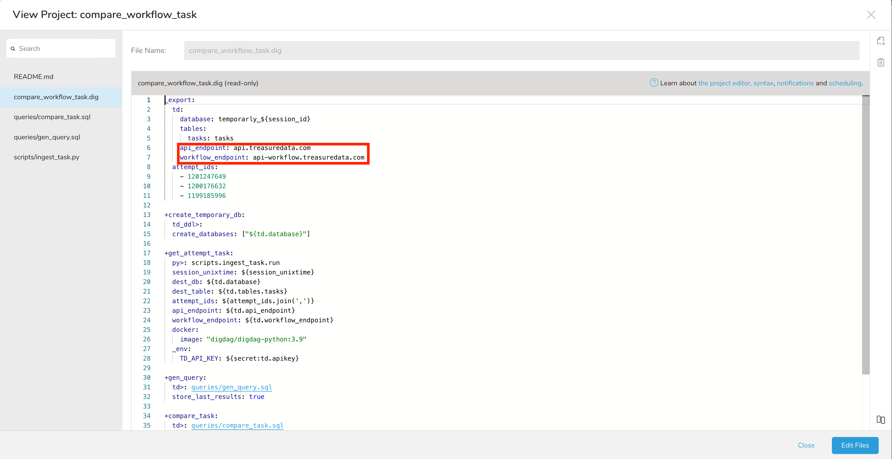
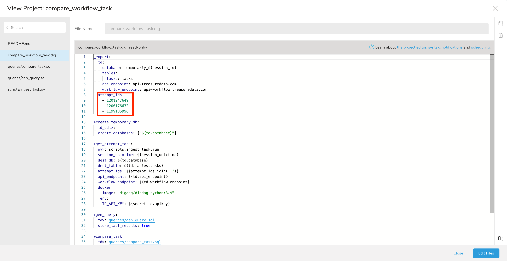
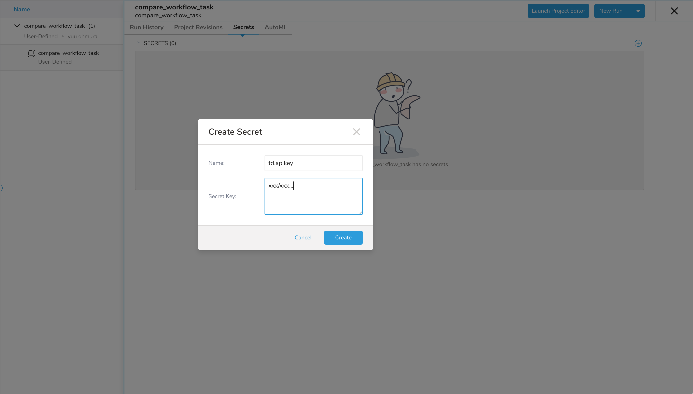
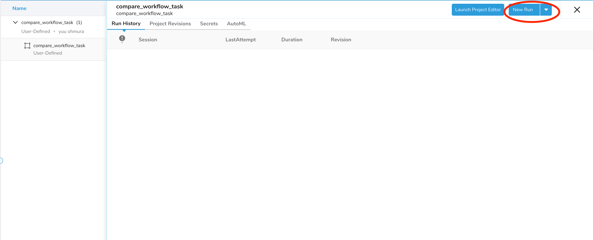
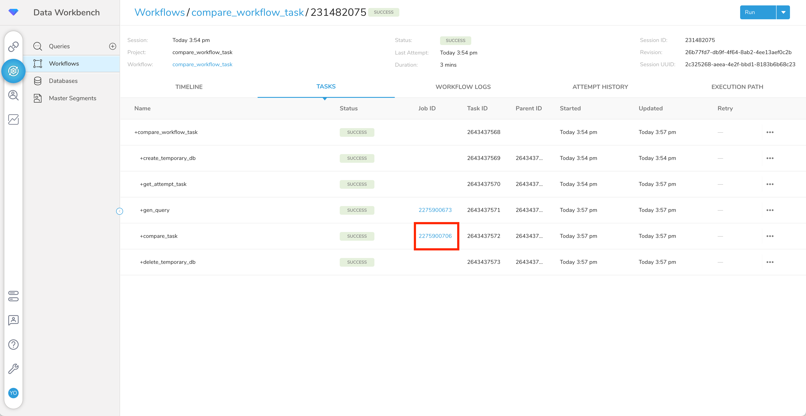
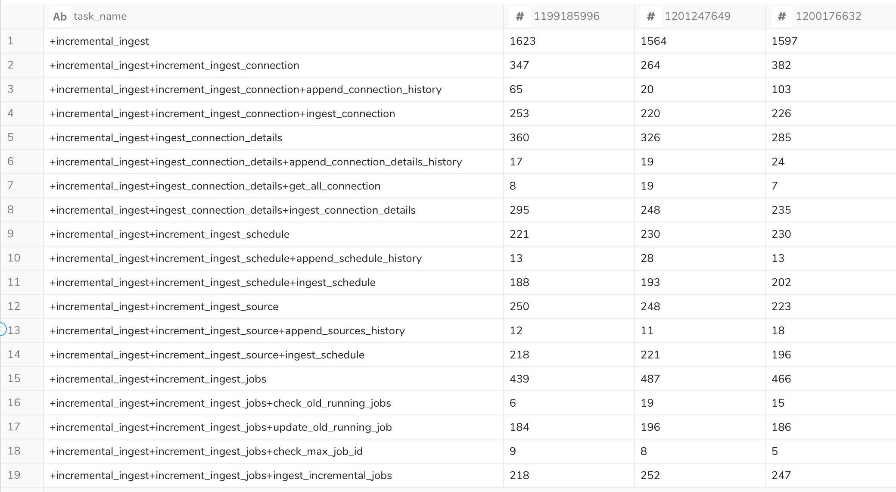

# Workflow: Scenario (compare tasks's duration in workflow between multiple attempts)

## Scenario

The purpose of  this scenario is to compare tasks's duration in workflow between multiple attemps.

### Steps
#### 1. push this workflow to Treasure Data
```
> cd compare_workflow_task
> td push compare_workflow_task
```

#### 2. configure endpoint settings
  - api_endpoint
  - workflow_endpoint


#### 3. configure attempts (you want to compare attempt)


#### 4. register td.apikey as a secret (Owner of td.apikey must be attempts which you specify.)


#### 5. run workflow



After this workflow run, you can get the following query result.




You can compare tasks's duration between multiple attempts.