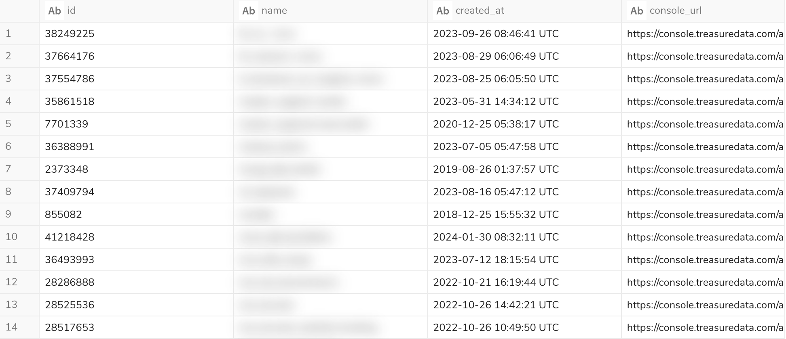
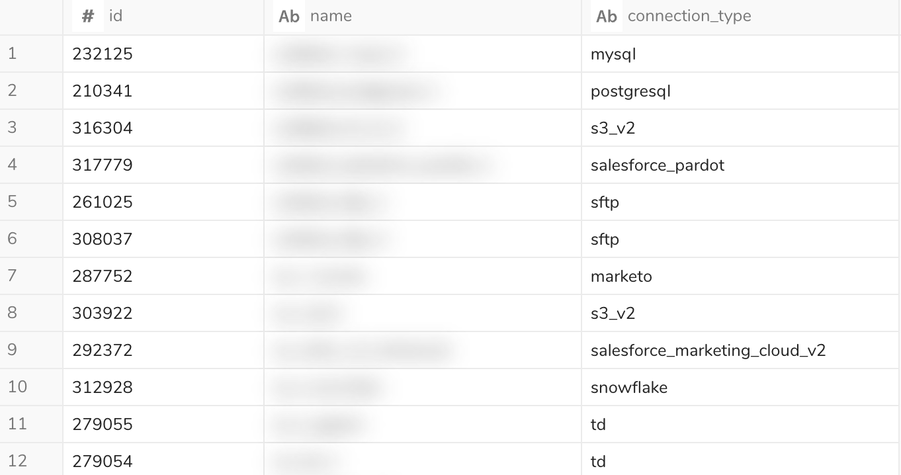
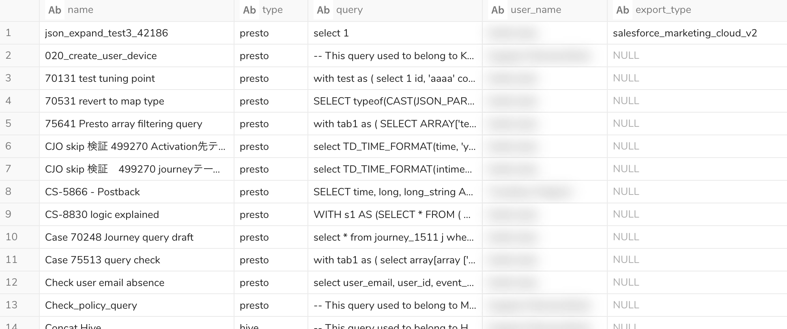
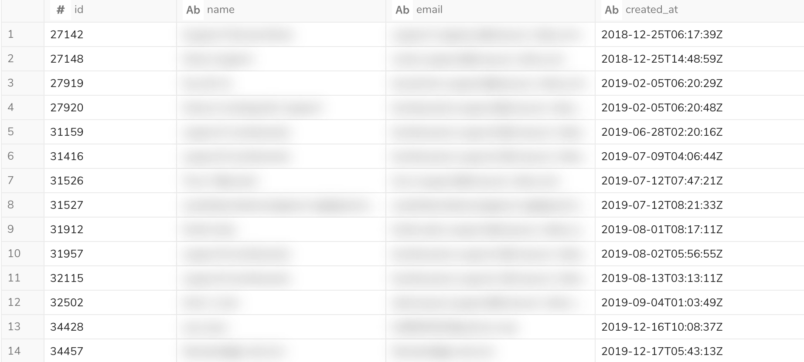
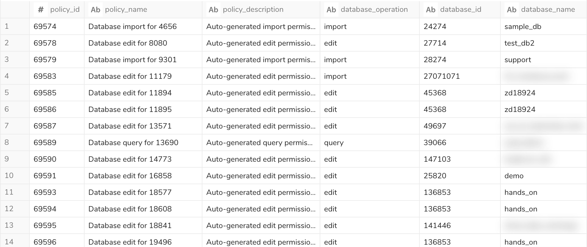
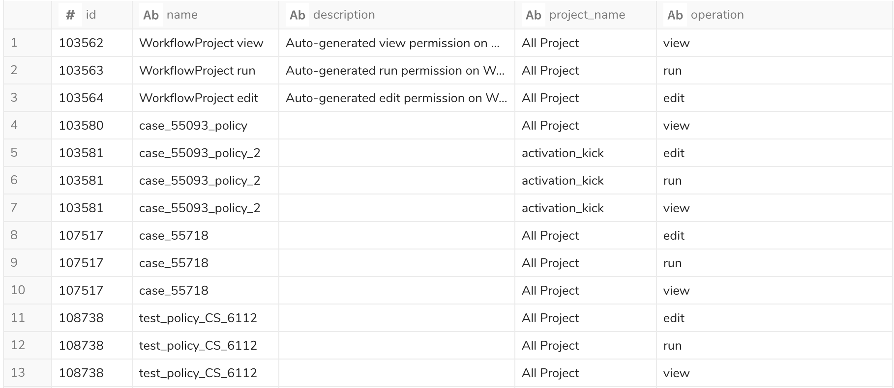
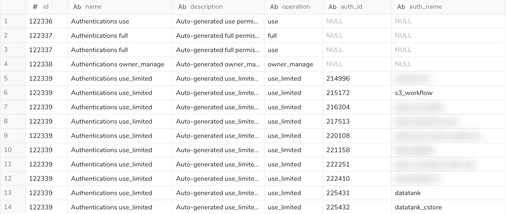

This document is a list of query samples for each tables of basic_monitoring database.

| # | file | reference table | description | result |
|----|----|----|----|----|
| 1 | [database_list.sql](database_list.sql) | basic_monitoring.databases | extract a list of Databases | |
| 2 | [connection_list.sql](connection_list.sql)| basic_monitoring.connections   basic_monitoring.connections_details| extract a list of Authentications |  |
| 3 | [query_list.sql](query_list.sql) | basic_monitoring.schedules | extract a list of Saved Queries |  |
| 4 | [user_list.sql](user_list.sql) | basic_monitoring.users | extract a list of Users |  |
| 5 | [db_permission_list_per_policy.sql](db_permission_list_per_policy.sql) | basic_monitoring.policies   basic_monitoring.policies_detail   basic_monitoring.databases| extract a list of db permission per policy |  |
| 6 | [workflow_permission_list_per_policy.sql](workflow_permission_list_per_policy.sql) | basic_monitoring.policies   basic_monitoring.policies_detail | extract a list of workflow permission per policy |  |
| 7 | [auth_permission_list_per_policy.sql](auth_permission_list_per_policy.sql) | basic_monitoring.policies   basic_monitoring.policies_detail   basic_monitoring.connections_details | extract a list of auth permission per policy |  |