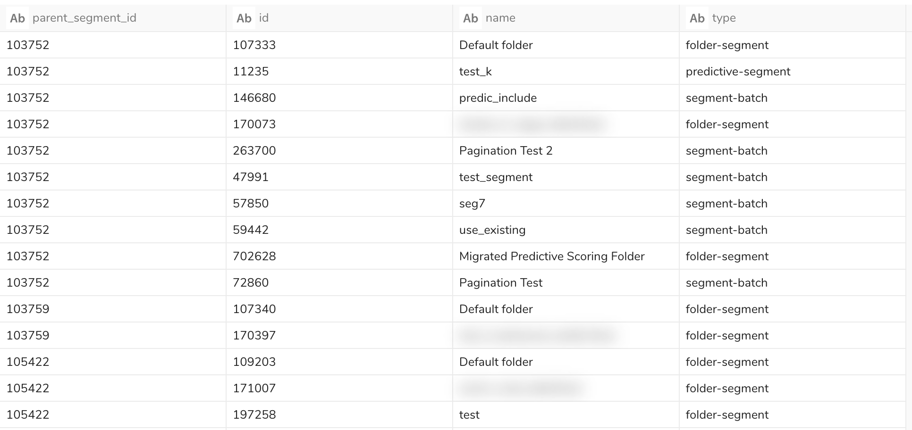

This document is a list of query samples for each tables of cdp_monitoring database.

| # | file | reference table | description | result |
|----|----|----|----|----|
| 1 | [parent_segment_list.sql](parent_segment_list.sql) | cdp_monitoring.parent_segments_configuration | extract a list of Parent Segment with cretedby and updatedby | |
| 2 | [entity_list_per_parent_segment.sql](entity_list_per_parent_segment.sql)| cdp_monitoring.entities| extract a list of entity per Parent Segment |  |
