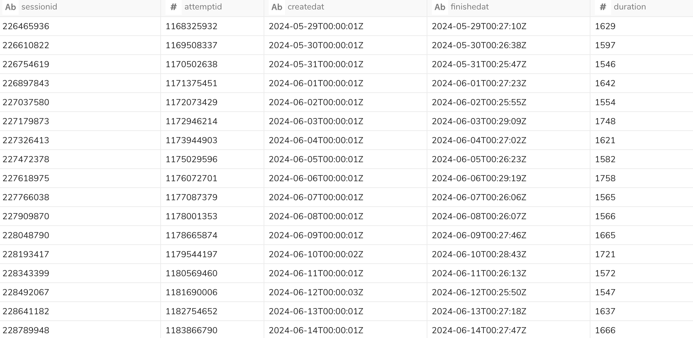

This document is a list of query samples for each table of workflow_monitoring database.

| # | file | reference table | description | result |
|----|----|----|----|----|
| 1 | [project_list.sql](project_list.sql) | workflow_monitoring.projects | extract a list of Project with last updated user |  |
| 2 | [workflow_list.sql](workflow_list.sql) | workflow_monitoring.workflows | extract a list of Workflow |  |
| 3 | [schedule_list.sql](schedule_list.sql) | workflow_monitoring.schedules | extract a list of scheduled workflow |  |
| 4 | [session_attempt_list_for_specific_workflow.sql](session_attempt_list_for_specific_workflow.sql) | workflow_monitoring.attempts | extract a list of session/attempt for specific workflow |  |

