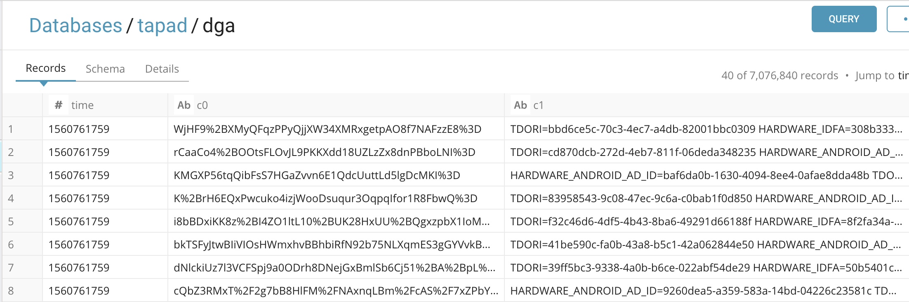
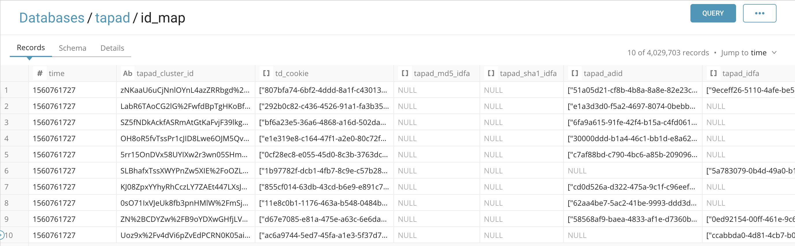

# Tapad data ingestion and id mapping creation
This workflow gets Tapad DGA file from their SFTP server and makes id mapping of cookies and idfa/adids by SQLs on TD.

## Prerequisites
### Cookie sync with Tapad
You need to sync your cookie which basically td_client_id or td_global_id with [Tapad](https://help.tapad.com/articles/cookie-syncing).
Please contact your TD Solution Architect to get customized td-js-sdk tag for cookie syncing.

### Tapad credentials and parameters
You also need to have following Tapad credentials and parameters to set those information in your [tapad_data_ingestion.dig](tapad_data_ingestion.dig) file.	

- sftp username
- sftp password
- DGA filename prefix
- Cookie prefix

### Push workflow and set secret
Download this workflow and push it to your TD environment, then set your sftp password as secret on the project.
```
$ td wf push tapad_data_ingestion
$ td wf secrets --project tapad_data_ingestion --set sftp.password
```

### Prepare database and tables
You need to have following database and tables to run this workflow. If you want to change name, you need to modify setting in [tapad_data_ingestion.dig](tapad_data_ingestion.dig) file accordingly.

```
$ td db:create tapad
$ td table:create tapad dga
$ td table:create tapad id_map
$ td table:create tapad idfa
$ td table:create tapad adid
```


## Schedule
Tapad DGA file is delivered every Wednesday around midnight. This workflow is scheduled every Wednesday 03:00(JST). 

## How it works
Here is brief description what each task in the workflow do.
1. Get Tapad DGA file from their SFTP server. Data are imported into dga table.
2. Make id mapping data between cookies and device ids(IDFA/ADID) with N-to-N array mapping format in id_map table.
3. Make id mapping data between cookies and IDFAs with 1-to-1 format in idfa table.
4. Make id mapping data between cookies and ADIDs with 1-to-1 format in adid table.

## Outputs
Here are snapshots how this workflow results in TD.
### DGA

### ID_MAP

### IDFA

### ADID


## Others
If you have any questions, please contact your Customer Success/Solution Architect of TD.
