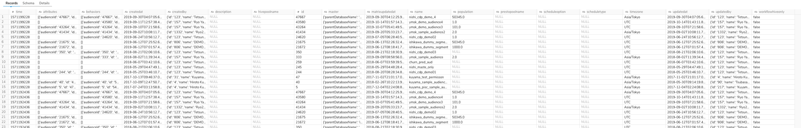
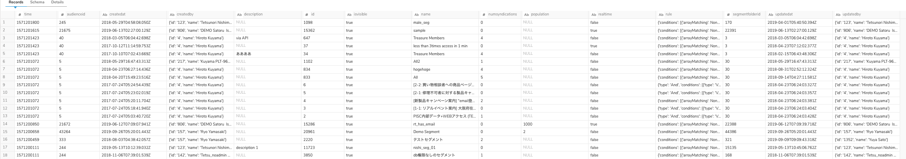

# Import Master Segment and Segment List
This workflow gets Master Segment and Segment List data via CDP-API and import data into a table.
These data include meta data of each Master Segment and Segments.

## How to use
### Push workflow and set secret
Download this workflow and push it to your TD environment, then set your td master api key as secret on the project.
```
$ td wf push cdp_segments
$ td wf secrets --project cdp_segments --set td.apikey
```

### Prepare database and table
You need to have following database and table to which data are imported.
```
$ td db:create example_db
$ td table:create master_segment_lists segment_lists
```

### TD endpoint
You need to modify td_endpoint / cdp_endpoint setting in dig file for your TD region accordingly.
See our [document](https://support.treasuredata.com/hc/en-us/articles/360001474288-Sites-and-Endpoints#Endpoints) for details.
```
    td_endpoint: "https://api.treasuredata.co.jp/"
    cdp_endpoint: "https://api-cdp.treasuredata.co.jp/"
```

## Output
You can see imported data in example_db.master_segment_lists/segment_lists.


