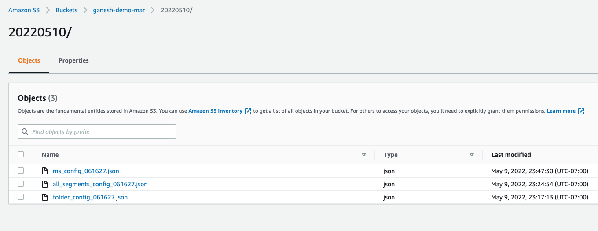
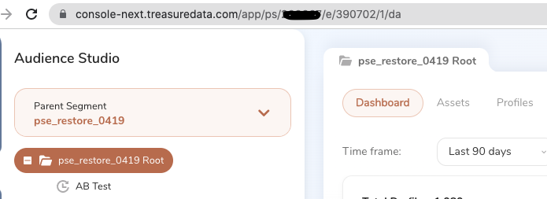

This workflow enables backup and restoration of a parent segment configuration, and that of underlying entities like segments and folders, without having to reconfigure from scratch. Useful in the event of accidental deletion of a segment by a user, for example.

With this solution, users can:

1. Take a Full Backup of the Parent Segment Configuration

2. Restore the Parent Segment from an earlier backup 

    - Restore Parent Segment under Data Workbench (V4)

    - Restore all Folders and all Segments as it is in the backup configuration in Audience Studio V5

TD Secrets that are common to backup and restore:
- endpoint - For US region it should be `https://api.treasuredata.com`, Europe → `api.eu01.treasuredata.com` and JP region → `api.treasuredata.co.jp` 
- s3.access_key_id - AWS access key ID to connect to s3
- s3.secret_access_key - Secret access key to connect to s3
- td.apikey - Master/Write-only API Key of the user

## Backup Parent Segment Configuration:

The backup solution is easier to run as it does not have any explicit steps to perform outside of this solution. A single run of the parent segment backup workflow, will take a backup of the entire parent segment config from Data Workbench, all Folder config with hierarchy details from Audience Studio v5 and all segment config from v5 as well.

As an output of the Backup solution there will be three .json files each for the PS configuration, Folder+Hierarchy configuration and Segment configuration at the location you specified (s3).

**Note**: The 3 configuration files will be stored under a directory that is created based on the run date, that will have format like YYYMMDD. Similarly, all 3 files are created in json format with session time appended to their names like ms_config_hhmmss.json. This will help to identify at which date and time these backups are taken. For example, from the above screenshot the directory that the files are created is 20220510/ and the files with utc timestamp appended are:
- Parent Segment configuration backup file → ms_config_061627.json 
- Folder and Hierarchy information backup file → folder_config_061627.json 
- Backup of all the segments combined in one backup file → all_segments_config_061627.json

### Requisites for Backup: 

For the initial version we have set the backup to be saved on both TD tables and also in a AWS S3 bucket. So when setting up backup, it is required to specify the table names and the s3 bucket where this has to be stored.

AWS S3 Authentication must be setup under Integration Hub, so that it can be used in the Backup solution to export the results to the mentioned s3 bucket.

The end user does not need to have any of SQL or digdag or Python expertise as users need only change the configuration YML files w.r.t backup and just follow steps provided below. 

## Steps to setup Parent Segment Backup:

1. config/input_params.yml - This config file has two parameters that determines if you would like to perform Backup or Restore.

	**Parameters** : enable_backup and enable_restore

	To perform backup, set enable_backup: yes and enable_restore: no

2. config/database.yml - Database name where all the below config tables resides. Update parameter database

3. config/backup_parent_seg.yml

	**Parameters**:
	- src_ms_id - Audience ID of the Parent Segment. Should be able to find this from url of the Parent Segment at Data Workbench → Master Segments → Respective Parent Segment.
	- root_folder_id - Folder ID of the root at Audience Studio V5. As in below screenshot, open Audience Studio V5, go to respect parent segment and identify the root folder ID from the url. In this example screenshot, 390702 is the root folder ID for parent segment pse_restore_0419.
	
	

	- stg_ms_config_tbl - Table where the Parent Segment Configuration will be backed up in TD.
	- stg_folder_curr_config_tbl - Temporary table that holds current Folder Configuration.
	- stg_folder_extract_tbl - Table where the folder configurations are persisted from every run of the backup workflow.
	- stg_seg_curr_config_tbl - Temporary table holds current Segment Configuration.
	- stg_seg_config_tbl - Table where the segment configurations are persisted from every run of the backup workflow.
	- s3.connection_name - Name of AWS S3 Authentication, configured at Integration Hub.
	- s3.bucket - AWS bucket where all the three configurations will be persisted.

4. Run main_wf.dig now to take a complete backup of all three configurations

### Restore Parent Segment Configuration:

Restoring Parent Segment from an existing backup has 3 parts to it. 

- Restore Parent Segment in Data Workbench at TD Console

- Run the Parent Segment that is restored in Data Workbench so that it generates the root folder in Audience Studio V5

- Now restore Folder configuration along with Segments from the existing backup

**Please note** for some TD accounts Audience Studio V5 is not enabled by default and so we will have to request our Operations Team to enable ***v5_endpoint*** flag for the corresponding Parent Segment that you restored in Data Workbench under ‘Master Segments’ 

### Requisites for Restore:

- For the initial version, the restore only takes configuration that is stored in the s3 bucket. In future, will extend this to either use backup from s3 connection or from TD tables itself

- As mentioned above Restore is a 3 step process, so after just restoring Parent Segment configuration into Data Workbench → Master Segments with parameter restore_ps_config_v4: yes, **run the Parent Segment once**. After it completes, enable parameter restore_folders_and_segments: yes and rerun the **main_wf.dig** again for restore.

- The end user does not need to have any of SQL or digdag or Python expertise as they only need to change the restortation YML configuration files and just follow steps provided below. 

## Steps to setup Parent Segment Restore:

### Part 1 - Restore Parent Segment in Data Work Bench

1. config/input_params.yml - This config file has two parameters that determines if you would like to perform Backup or Restore **Parameters**: enable_backup and enable_restoreTo perform restore, set enable_backup: no and enable_restore: yes

2. config/database.yml - Database name where all the below config tables resides. Update parameter database.

    - config/restore_parent_seg.yml - It is the main configuration file that needs to be set for restore process and this will require the following **parameters**:
		- ms_name - New name for the Parent Segment
		- ms_table_restore - Table Name to write results from Parent Segment configuration json file
		- folder_stg_tbl - Table Name to write results from Folder configuration json file
		- root_folder_id - Not required to be set for Part 1
		- aws_bucket_name - AWS s3 bucket name
		- aws_ms_config_path - Path prefix of the parent segment config json file
		- aws_folder_config_path - Path prefix of the folder configuration json file
		- restore_ps_config_v4 - Set to ‘yes’ for Part 1 where we only restore the Parent Segment config
		- restore_folders_and_segments_v5 - Set to ‘no’ for Part 1, as restoring folder and segment entities require Part 2 to be completed.

3. Run the main_wf.dig workflow now to restore Parent Segment configuration in Data Workbench

### Part 2 - Run Parent Segment

1. Make sure Part 1 is complete, that is, check if main_wf.dig did complete and ran to success

2. Now run the Parent Segment in Data Workbench and wait for it to complete

3. Once Parent Segment runs to success, open Audience Studio V5 to check if a Root folder is created with name **“<PS_Name> Root”**

4. Will require this Root Folder ID to perform Part 3, that is to restore Folder and Segment entities

5. If there is no Root Folder found in Audience Studio V5 after the Parent Segment run, it is probably because of a feature flag not set for this Audience. Reach out to Support Team for this.

### Part 3 - Restore Folder and Segment Entities

1. All the configurations are same as Part 1, except the below 3 parameters:
	- root_folder_id - Grab the folder ID after the Parent Segment run as mentioned in Part 2.
	- restore_ps_config_v4 - Set to ‘no’.
	- restore_folders_and_segments_v5 - Set to ‘yes’. This will enable folder and segment entities to be restored in Audience Studio V5

2. Run main_wf.dig workflow now to restore folders and segments under the new root folder

### Project Details:

- **main_wf.dig** - Parent workflow that triggers corresponding Backup or Restore workflows based on the config/input_params.yml setting
- **master_seg_backup.dig** - Workflow that captures full backup of Parent Segment configuration along with Folder & Segment configuration
- **master_seg_restore.dig** - Workflow that restores Parent Segment configuration and Folder & Segment configuration separately
- **python_script/restore_main.py** - Python script that is triggered from master_seg_restore.dig workflow and is responsible for restoring Folder and Segment Entities

### Limitations/Possibilities:

- Backup to other destinations other than Treasure Data or AWS s3 is possible, just that a corresponding connection has to be created under Integrations Hub → Authentications and use that connection name in config/backup_parent_seg.yml file instead of AWS s3

- The current form of project supports only Full Restore, that is it restores all the folder and segment entities under a new Root Folder or under an empty Root Folder with no folders or segments under it. To restore folders or segments under an already existing configuration requires a minimal change to the restore_main.py script. Kindly reach out to Support Team if requires help on this.

- Also for now these three entities are allowed to be restored → folder-segment , segment-batch and predicitve-segment . Currently WIP to include realtime segments and other types as well.